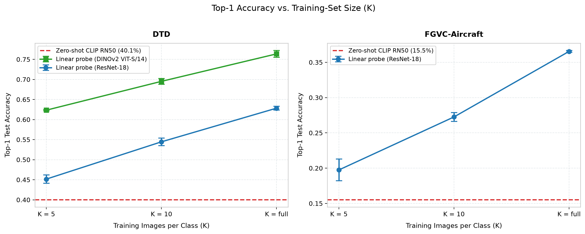
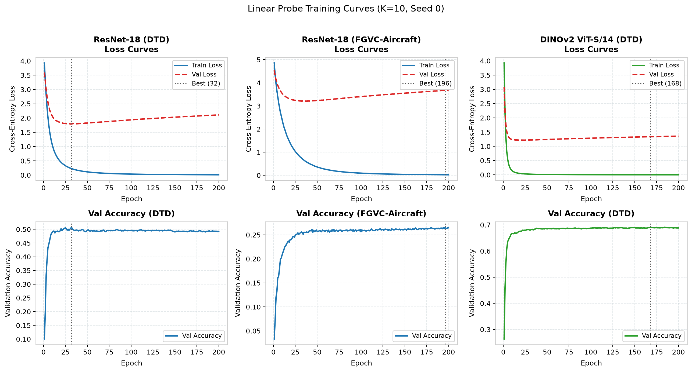
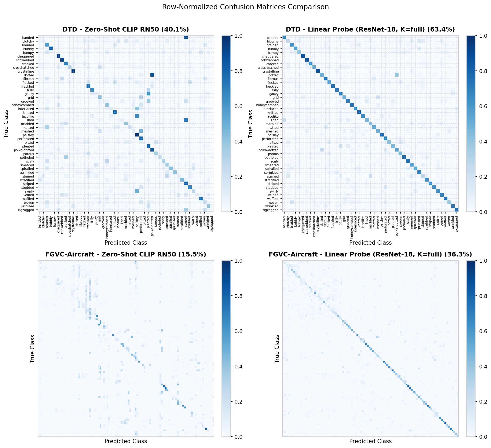
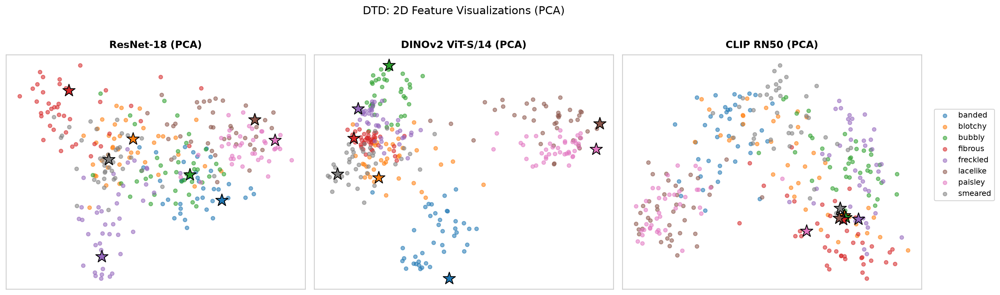
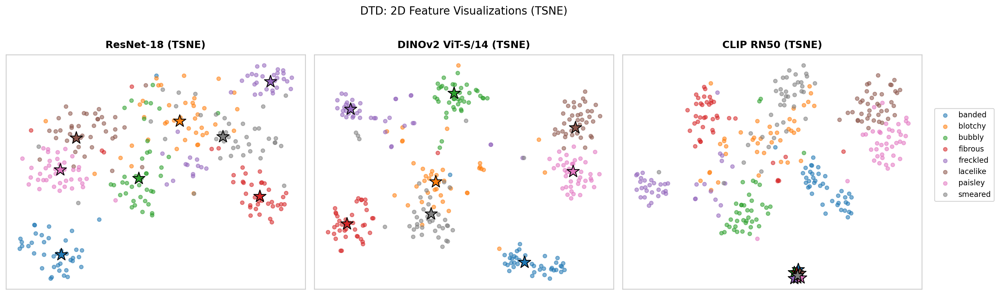
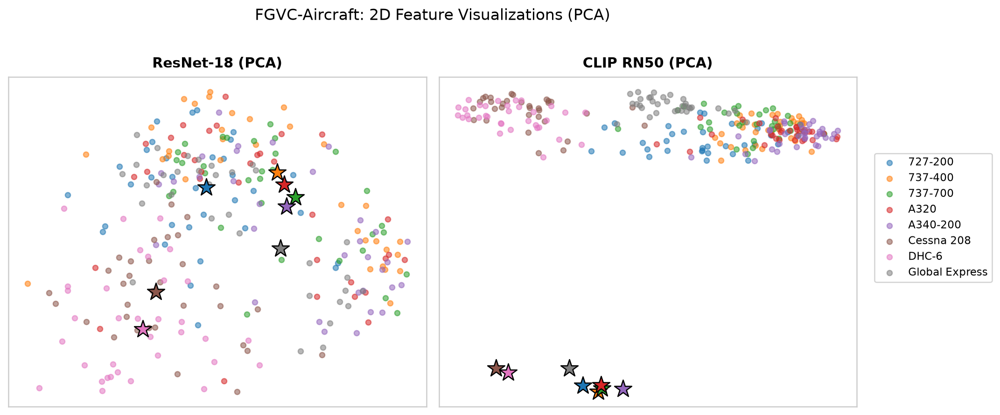

# Stage 1 Results: Classification Baselines

Produced by `notebooks/classifiers_baselines.ipynb`. Figures are taken from that notebook's
outputs and stored in `docs/figures/`.

| Item | Value |
| --- | --- |
| Datasets | DTD (47 classes, partition 1), FGVC-Aircraft (100 classes, variant level) |
| Splits | official train / val / test, never merged |
| Encoders | ResNet-18 (512-d), DINOv2 ViT-S/14 (384-d), CLIP RN50 (1024-d) — all frozen |
| Baselines | Linear probe (required) + **Option B, zero-shot CLIP** |
| Probe config | AdamW, lr 1e-3, wd 1e-4, batch 64, 200 epochs, best val accuracy |
| Metric | Top-1 accuracy on the complete official test split |
| Runs | 27 linear probes (3 cells x K in {5, 10, full} x 3 seeds) + 2 zero-shot |

---

## 1. Accuracy Table

Mean +/- std over 3 runs. For K = 5 and K = 10 the seeds select the balanced subset; for
K = full they vary the classifier initialization. Zero-shot CLIP uses no labeled images, so it
is one run per dataset.

### DTD

| Method | Encoder | K | Top-1 accuracy |
| --- | --- | --- | --- |
| Linear probe | ResNet-18 | 5 | 0.4514 +/- 0.0105 |
| Linear probe | ResNet-18 | 10 | 0.5445 +/- 0.0094 |
| Linear probe | ResNet-18 | full | 0.6284 +/- 0.0045 |
| Linear probe | DINOv2 ViT-S/14 | 5 | 0.6234 +/- 0.0014 |
| Linear probe | DINOv2 ViT-S/14 | 10 | 0.6952 +/- 0.0074 |
| Linear probe | DINOv2 ViT-S/14 | full | **0.7637 +/- 0.0083** |
| Zero-shot CLIP | CLIP RN50 | n/a | 0.4005 |

### FGVC-Aircraft

| Method | Encoder | K | Top-1 accuracy |
| --- | --- | --- | --- |
| Linear probe | ResNet-18 | 5 | 0.1972 +/- 0.0162 |
| Linear probe | ResNet-18 | 10 | 0.2720 +/- 0.0056 |
| Linear probe | ResNet-18 | full | **0.3662 +/- 0.0027** |
| Zero-shot CLIP | CLIP RN50 | n/a | 0.1545 |

Per-run detail (27 runs), with the epoch selected by checkpointing

| Encoder | Dataset | K | Seed | Train images | Val acc @ epoch | Test acc |
| --- | --- | --- | --- | --- | --- | --- |
| ResNet-18 | DTD | 5 | 0 | 235 | 0.4489 @ 125 | 0.4628 |
| ResNet-18 | DTD | 5 | 1 | 235 | 0.4553 @ 31 | 0.4420 |
| ResNet-18 | DTD | 5 | 2 | 235 | 0.4309 @ 150 | 0.4495 |
| ResNet-18 | DTD | 10 | 0 | 470 | 0.5074 @ 32 | 0.5399 |
| ResNet-18 | DTD | 10 | 1 | 470 | 0.5383 @ 65 | 0.5383 |
| ResNet-18 | DTD | 10 | 2 | 470 | 0.5144 @ 27 | 0.5553 |
| ResNet-18 | DTD | full | 0 | 1880 | 0.6085 @ 23 | 0.6335 |
| ResNet-18 | DTD | full | 1 | 1880 | 0.6064 @ 16 | 0.6255 |
| ResNet-18 | DTD | full | 2 | 1880 | 0.6064 @ 18 | 0.6261 |
| ResNet-18 | Aircraft | 5 | 0 | 500 | 0.1869 @ 75 | 0.1794 |
| ResNet-18 | Aircraft | 5 | 1 | 500 | 0.2055 @ 182 | 0.2010 |
| ResNet-18 | Aircraft | 5 | 2 | 500 | 0.2061 @ 183 | 0.2112 |
| ResNet-18 | Aircraft | 10 | 0 | 1000 | 0.2658 @ 196 | 0.2778 |
| ResNet-18 | Aircraft | 10 | 1 | 1000 | 0.2571 @ 158 | 0.2667 |
| ResNet-18 | Aircraft | 10 | 2 | 1000 | 0.2520 @ 46 | 0.2715 |
| ResNet-18 | Aircraft | full | 0 | 3334 | 0.3831 @ 164 | 0.3633 |
| ResNet-18 | Aircraft | full | 1 | 3334 | 0.3843 @ 175 | 0.3687 |
| ResNet-18 | Aircraft | full | 2 | 3334 | 0.3834 @ 157 | 0.3666 |
| DINOv2 | DTD | 5 | 0 | 235 | 0.6197 @ 192 | 0.6250 |
| DINOv2 | DTD | 5 | 1 | 235 | 0.6319 @ 157 | 0.6229 |
| DINOv2 | DTD | 5 | 2 | 235 | 0.6330 @ 193 | 0.6223 |
| DINOv2 | DTD | 10 | 0 | 470 | 0.6910 @ 168 | 0.6910 |
| DINOv2 | DTD | 10 | 1 | 470 | 0.7085 @ 140 | 0.7037 |
| DINOv2 | DTD | 10 | 2 | 470 | 0.6644 @ 190 | 0.6910 |
| DINOv2 | DTD | full | 0 | 1880 | 0.7596 @ 12 | 0.7569 |
| DINOv2 | DTD | full | 1 | 1880 | 0.7628 @ 30 | 0.7729 |
| DINOv2 | DTD | full | 2 | 1880 | 0.7681 @ 16 | 0.7612 |

---

## 2. Accuracy vs. Training-Set Size

Error bars are the std over 3 runs; zero-shot CLIP is a horizontal reference line.

- Accuracy grows monotonically with K, and the spread shrinks as K grows.
- DINOv2 at K = 10 on DTD (0.6952) beats ResNet-18 trained on the **full** split (0.6284) —
  representation quality matters more than label quantity.
- Zero-shot CLIP falls below the 5-shot probe on both datasets, but uses no labels at all.
- Aircraft is much harder than DTD: 100 fine-grained variants separated by subtle details.

---

## 3. Training Curves

Representative 10-shot run (seed 0) per encoder/dataset cell. The dotted line marks the
selected checkpoint.

- Training is stable: the train loss falls smoothly and monotonically at lr 1e-3, with no
  oscillation or divergence in any of the three cells.
- The train loss reaches ~0 while the validation loss bottoms out early (around epoch 30 for
  ResNet-18, epoch 15 for DINOv2) and then rises steadily - which is an overfitting signature.
- Substantial overfitting occur in the loss, but not in the metric. Validation accuracy
  rises quickly and then stays flat (~0.50 DTD/ResNet-18, ~0.26 Aircraft, ~0.69 DTD/DINOv2)
  instead of degrading. The probe grows overconfident on examples it already classifies
  correctly, which inflates cross-entropy without flipping the argmax. Since checkpointing uses
  validation accuracy, the selected epochs land late (32, 196, 168) and test accuracy is
  essentially unaffected.

---

## 4. Confusion Matrices

Row-normalized, full test split: zero-shot CLIP vs. the ResNet-18 probe (K = full, seed 0).
DTD shows class labels; Aircraft's 100 classes are left unlabeled for readability.

- The probe has a stronger diagonal than zero-shot on both datasets.
- Errors concentrate in semantically overlapping groups: similar texture families on DTD, and
  same-family aircraft variants on Aircraft.

---

## 5. Feature Visualizations

Eight fixed classes per dataset, with the same classes, examples and colors across encoders.
Stars are class prototypes — image-derived for ResNet-18 and DINOv2, text-derived for CLIP.
The projection is fitted jointly on the features and prototypes shown.

**DTD (PCA)**

**DTD (t-SNE)**

**FGVC-Aircraft (PCA)**

- DINOv2's DTD clusters are tighter than ResNet-18's, matching the accuracy gap.
- CLIP's text prototypes sit in a separate region from the image cloud.
  CLIP encodes images and text with two different networks, and its contrastive objective only
  constrains relative similarity: it needs `cos(image_i, text_i)` to beat
  `cos(image_i, text_j)`, which stays true if every text embedding is shifted together. Nothing
  in the loss pulls the two modalities onto each other, so they settle into two narrow, almost
  disjoint cones — even a correctly matched image/text pair typically reaches only ~0.2-0.3
  cosine similarity, not ~1.0. Classification is unaffected because that shared offset adds
  roughly the same amount to every class score, so the argmax is still decided by the
  differences among the text prototypes. In PCA the gap is the largest single direction of
  variance, so PC1 is spent separating text from images rather than separating classes.

---

## Reproducing

Run `notebooks/classifiers_baselines.ipynb` on Colab. With feature caches and `runs.csv`
restored from Drive, the download and extraction cells can be skipped.

Subset indices are sampled with `np.random.default_rng(seed)` and persisted, so all encoders
see identical K-shot subsets; initialization and batching are seeded per run; features are
extracted with `shuffle=False` so cached rows stay aligned with labels.

