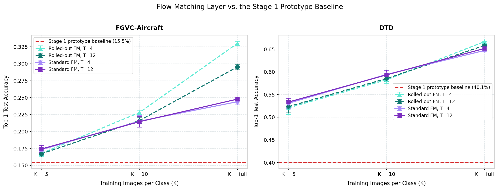
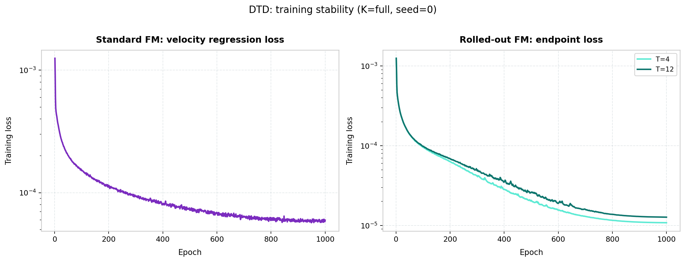
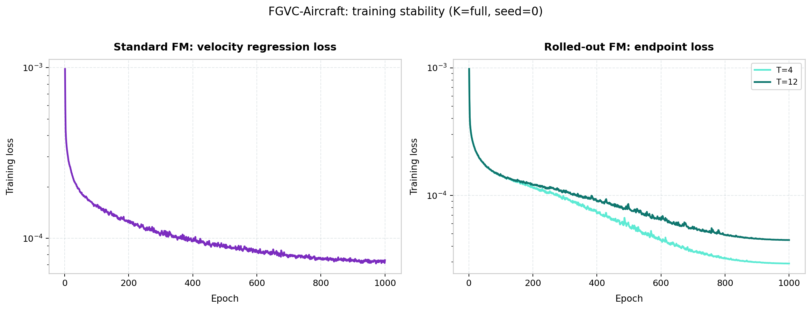
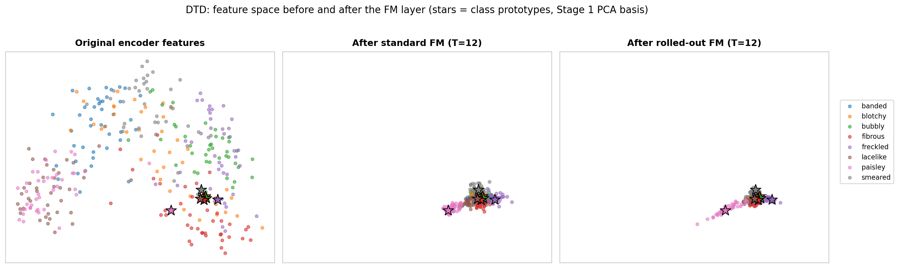
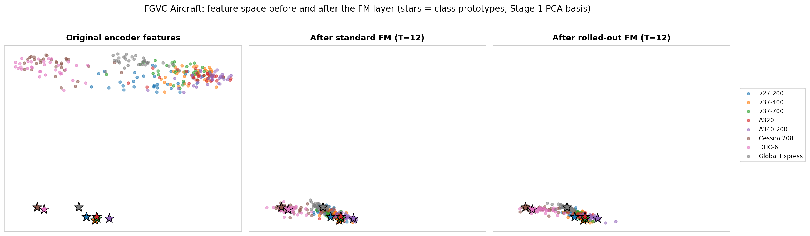
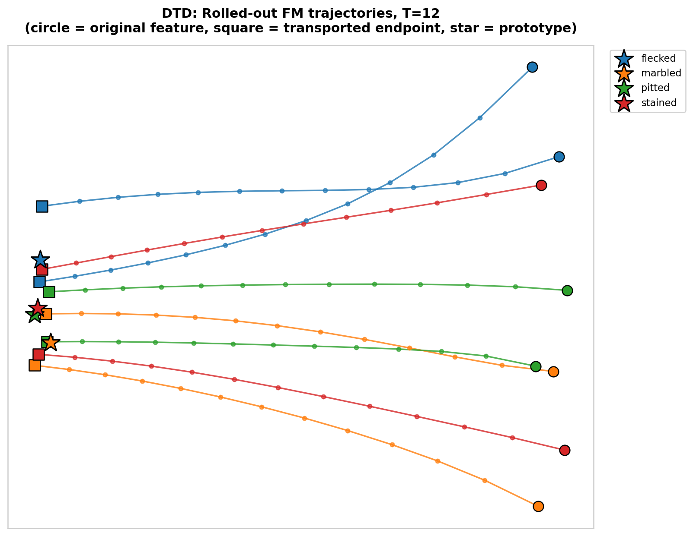
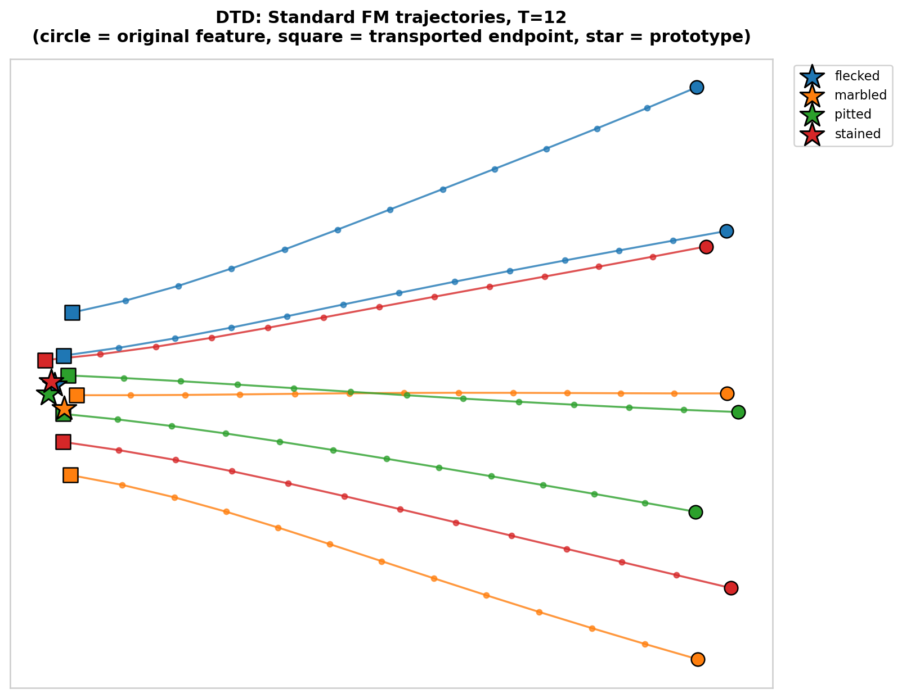
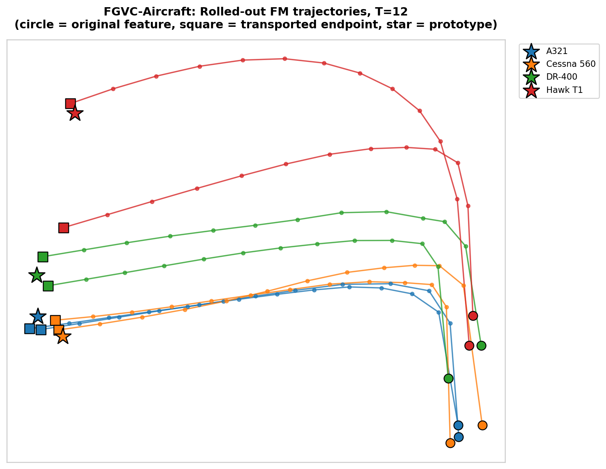
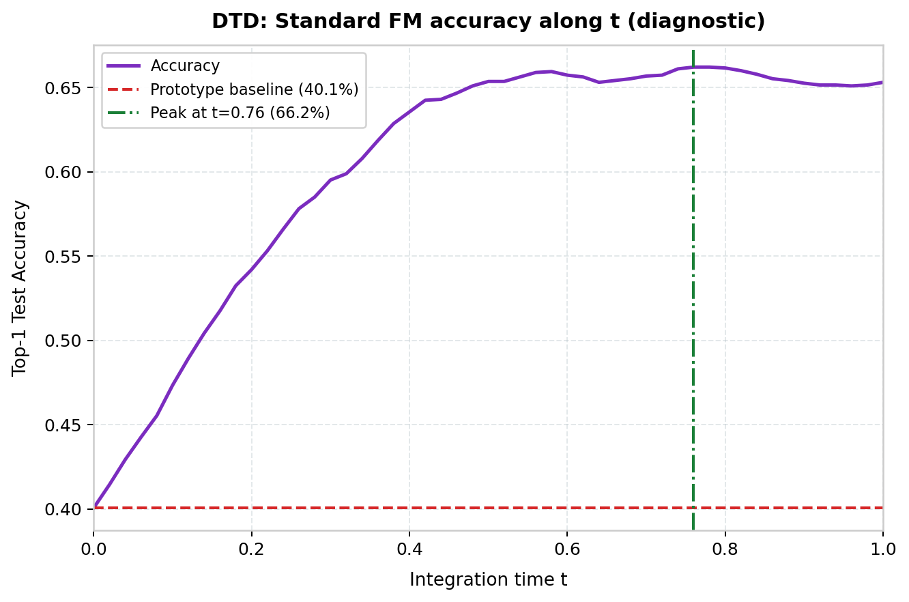
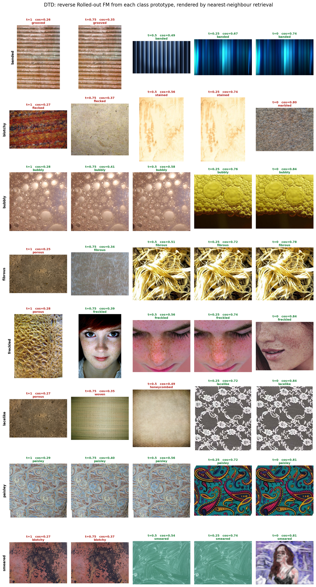

# Stage 2 Results: Flow Matching as a Layer

Produced by `notebooks/stage2_flow_matching.ipynb`.

A small velocity field `v(z, t)` is trained to transport a frozen CLIP RN50 image embedding
at t=0 onto its frozen CLIP **text** prototype at t=1. At test time the field is applied to
an **unlabelled** embedding for T Euler steps, and the transported embedding is classified
with the same cosine 1-NN rule as the Stage 1 zero-shot baseline.

| Item | Value |
| --- | --- |
| Datasets | DTD (47 classes, partition 1), FGVC-Aircraft (100 classes, variant level) |
| Encoder | CLIP RN50 (1024-d), frozen; features cached from Stage 1 |
| Target | Frozen CLIP text prototype `p_c` of the true class |
| Baseline | Stage 1 zero-shot CLIP: DTD 0.4005, Aircraft 0.1545 |
| Objectives | Standard FM (`L_FM`) and rolled-out FM (`L_roll`) |
| Euler steps | T in {4, 12} |
| Protocol | K in {5, 10, full} x seeds {0, 1, 2}, reusing the Stage 1 subsets |
| Field | MLP 1025 -> 512 -> 512 -> 1024, SiLU, scalar t concatenated (1.31 M params) |
| Optimiser | AdamW, lr 1e-3 cosine-annealed to 1e-5, wd 1e-4, batch 256, 1000 epochs |
| Selection | Checkpoint with the best mean validation rollout accuracy |
| Metric | Top-1 accuracy on the complete official test split, at the endpoint `z_T` |
| Runs | 54 trained fields -> 72 result rows (36 standard + 36 rolled-out) |

---

## 1. Method

**Standard flow matching.** Sample `t ~ U[0,1]` per example, interpolate on the straight
conditional-OT path and regress its constant velocity:

```
z_t = (1 - t) z_i + t p_yi        u_i = p_yi - z_i        L_FM = || v(z_t, t) - u_i ||^2
```

**Rolled-out flow matching.** Run the inference loop itself and supervise only where it
lands, backpropagating through all T network calls:

```
z_0 = z_i,  z_{k+1} = z_k + (1/T) v(z_k, k/T)        L_roll = || z_T - p_yi ||^2
```

**Inference (both).** T Euler steps of size 1/T from the test embedding, then cosine 1-NN
against the text prototypes. `z_T` is at t=1 for both T values; T only controls how coarsely
the interval is discretised, so the two step counts are two approximations of the same map.

Standard FM does not depend on T at training time, so one field per (dataset, K, seed) is
trained and scored at both step counts; its checkpoint is selected on the mean validation
accuracy over T=4 and T=12. Rolled-out FM bakes T into the loss, so it gets one field per T,
with the same T at train and test. Architecture, optimiser, epochs and batch size are
identical across the two objectives.

### Small modifications, and why

| Change                                     | Reason |
|--------------------------------------------| --- |
| Output layer zero-initialised              | Makes the untrained field the identity, so t=0 reproduces the Stage 1 baseline exactly. Every diagnostic run asserts `\|acc(t=0) - baseline\| < 5e-3`. |
| Inputs L2-normalised once, before training | Stage 1 classifies with cosine, so length carries no class information, and CLIP's image and text towers have different norm scales. Without it `u_i = p_c - z_i` would be dominated by a length mismatch the classifier then discards. |
| Cosine-annealed learning rate, 1000 epochs | A first pass at 300 epochs and a constant lr was under-trained - see Section 4. |

---

## 2. Accuracy Table

Mean +/- std over 3 seeds. For K = 5 and K = 10 the seeds select the balanced subset; for
K = full the subset is fixed and the seeds vary initialisation and batch order. `dAcc` is
measured against the Stage 1 zero-shot baseline of the same dataset.

### DTD (baseline 0.4005)

| Variant | T | K | Top-1 accuracy | dAcc |
| --- | --- | --- | --- | --- |
| Standard FM | 4 | 5 | 0.5309 +/- 0.0112 | +0.1303 |
| Standard FM | 12 | 5 | 0.5335 +/- 0.0086 | +0.1330 |
| Rolled-out FM | 4 | 5 | 0.5207 +/- 0.0148 | +0.1202 |
| Rolled-out FM | 12 | 5 | 0.5234 +/- 0.0138 | +0.1229 |
| Standard FM | 4 | 10 | 0.5943 +/- 0.0085 | +0.1938 |
| Standard FM | 12 | 10 | 0.5934 +/- 0.0104 | +0.1929 |
| Rolled-out FM | 4 | 10 | 0.5826 +/- 0.0078 | +0.1821 |
| Rolled-out FM | 12 | 10 | 0.5853 +/- 0.0056 | +0.1848 |
| Standard FM | 4 | full | 0.6473 +/- 0.0033 | +0.2468 |
| Standard FM | 12 | full | 0.6518 +/- 0.0040 | +0.2512 |
| Rolled-out FM | 4 | full | **0.6668 +/- 0.0011** | **+0.2663** |
| Rolled-out FM | 12 | full | 0.6583 +/- 0.0027 | +0.2578 |

### FGVC-Aircraft (baseline 0.1545)

| Variant | T | K | Top-1 accuracy | dAcc |
| --- | --- | --- | --- | --- |
| Standard FM | 4 | 5 | 0.1731 +/- 0.0031 | +0.0186 |
| Standard FM | 12 | 5 | 0.1741 +/- 0.0054 | +0.0196 |
| Rolled-out FM | 4 | 5 | 0.1675 +/- 0.0041 | +0.0130 |
| Rolled-out FM | 12 | 5 | 0.1670 +/- 0.0022 | +0.0125 |
| Standard FM | 4 | 10 | 0.2151 +/- 0.0087 | +0.0606 |
| Standard FM | 12 | 10 | 0.2144 +/- 0.0079 | +0.0599 |
| Rolled-out FM | 4 | 10 | 0.2279 +/- 0.0026 | +0.0734 |
| Rolled-out FM | 12 | 10 | 0.2160 +/- 0.0042 | +0.0615 |
| Standard FM | 4 | full | 0.2439 +/- 0.0047 | +0.0894 |
| Standard FM | 12 | full | 0.2477 +/- 0.0017 | +0.0932 |
| Rolled-out FM | 4 | full | **0.3299 +/- 0.0034** | **+0.1754** |
| Rolled-out FM | 12 | full | 0.2952 +/- 0.0042 | +0.1407 |

The layer helps everywhere. The best setting adds **+26.6 points on DTD**
(0.4005 -> 0.6668, +66% relative) and **+17.5 points on Aircraft** (0.1545 -> 0.3299, +114%
relative), and no cell in either table is below its baseline.

<details>
<summary>Per-run detail (72 rows), with the final training loss of each field</summary>

`Loss` is the mean training loss at epoch 1000 of the field that produced the row: a velocity
MSE for standard FM, an endpoint MSE for rolled-out FM. Standard rows share one field per
(dataset, K, seed), hence one loss value across both step counts. The scored checkpoint is
the best-validation one, which is not always the last epoch.

| Variant | Dataset | K | Seed | T | Loss | Test acc | dAcc |
| --- | --- | --- | --- | --- | --- | --- | --- |
| Standard | Aircraft | 5 | 0 | 4 | 0.000090 | 0.1716 | +0.0171 |
| Standard | Aircraft | 5 | 0 | 12 | 0.000090 | 0.1701 | +0.0156 |
| Rolled-out | Aircraft | 5 | 0 | 4 | 0.000056 | 0.1707 | +0.0162 |
| Rolled-out | Aircraft | 5 | 0 | 12 | 0.000059 | 0.1656 | +0.0111 |
| Standard | Aircraft | 5 | 1 | 4 | 0.000094 | 0.1767 | +0.0222 |
| Standard | Aircraft | 5 | 1 | 12 | 0.000094 | 0.1803 | +0.0258 |
| Rolled-out | Aircraft | 5 | 1 | 4 | 0.000058 | 0.1689 | +0.0144 |
| Rolled-out | Aircraft | 5 | 1 | 12 | 0.000061 | 0.1695 | +0.0150 |
| Standard | Aircraft | 5 | 2 | 4 | 0.000092 | 0.1710 | +0.0165 |
| Standard | Aircraft | 5 | 2 | 12 | 0.000092 | 0.1719 | +0.0174 |
| Rolled-out | Aircraft | 5 | 2 | 4 | 0.000057 | 0.1629 | +0.0084 |
| Rolled-out | Aircraft | 5 | 2 | 12 | 0.000060 | 0.1659 | +0.0114 |
| Standard | Aircraft | 10 | 0 | 4 | 0.000081 | 0.2250 | +0.0705 |
| Standard | Aircraft | 10 | 0 | 12 | 0.000081 | 0.2235 | +0.0690 |
| Rolled-out | Aircraft | 10 | 0 | 4 | 0.000048 | 0.2307 | +0.0762 |
| Rolled-out | Aircraft | 10 | 0 | 12 | 0.000050 | 0.2202 | +0.0657 |
| Standard | Aircraft | 10 | 1 | 4 | 0.000080 | 0.2115 | +0.0570 |
| Standard | Aircraft | 10 | 1 | 12 | 0.000080 | 0.2100 | +0.0555 |
| Rolled-out | Aircraft | 10 | 1 | 4 | 0.000048 | 0.2256 | +0.0711 |
| Rolled-out | Aircraft | 10 | 1 | 12 | 0.000051 | 0.2118 | +0.0573 |
| Standard | Aircraft | 10 | 2 | 4 | 0.000078 | 0.2088 | +0.0543 |
| Standard | Aircraft | 10 | 2 | 12 | 0.000078 | 0.2097 | +0.0552 |
| Rolled-out | Aircraft | 10 | 2 | 4 | 0.000047 | 0.2274 | +0.0729 |
| Rolled-out | Aircraft | 10 | 2 | 12 | 0.000050 | 0.2160 | +0.0615 |
| Standard | Aircraft | full | 0 | 4 | 0.000074 | 0.2394 | +0.0849 |
| Standard | Aircraft | full | 0 | 12 | 0.000074 | 0.2457 | +0.0912 |
| Rolled-out | Aircraft | full | 0 | 4 | 0.000029 | 0.3309 | +0.1764 |
| Rolled-out | Aircraft | full | 0 | 12 | 0.000045 | 0.2910 | +0.1365 |
| Standard | Aircraft | full | 1 | 4 | 0.000073 | 0.2436 | +0.0891 |
| Standard | Aircraft | full | 1 | 12 | 0.000073 | 0.2487 | +0.0942 |
| Rolled-out | Aircraft | full | 1 | 4 | 0.000028 | 0.3327 | +0.1782 |
| Rolled-out | Aircraft | full | 1 | 12 | 0.000043 | 0.2994 | +0.1449 |
| Standard | Aircraft | full | 2 | 4 | 0.000072 | 0.2487 | +0.0942 |
| Standard | Aircraft | full | 2 | 12 | 0.000072 | 0.2487 | +0.0942 |
| Rolled-out | Aircraft | full | 2 | 4 | 0.000029 | 0.3261 | +0.1716 |
| Rolled-out | Aircraft | full | 2 | 12 | 0.000049 | 0.2952 | +0.1407 |
| Standard | DTD | 5 | 0 | 4 | 0.000101 | 0.5415 | +0.1410 |
| Standard | DTD | 5 | 0 | 12 | 0.000101 | 0.5415 | +0.1410 |
| Rolled-out | DTD | 5 | 0 | 4 | 0.000033 | 0.5330 | +0.1324 |
| Rolled-out | DTD | 5 | 0 | 12 | 0.000036 | 0.5346 | +0.1340 |
| Standard | DTD | 5 | 1 | 4 | 0.000104 | 0.5319 | +0.1314 |
| Standard | DTD | 5 | 1 | 12 | 0.000104 | 0.5346 | +0.1340 |
| Rolled-out | DTD | 5 | 1 | 4 | 0.000033 | 0.5250 | +0.1245 |
| Rolled-out | DTD | 5 | 1 | 12 | 0.000036 | 0.5277 | +0.1271 |
| Standard | DTD | 5 | 2 | 4 | 0.000095 | 0.5191 | +0.1186 |
| Standard | DTD | 5 | 2 | 12 | 0.000095 | 0.5245 | +0.1239 |
| Rolled-out | DTD | 5 | 2 | 4 | 0.000033 | 0.5043 | +0.1037 |
| Rolled-out | DTD | 5 | 2 | 12 | 0.000037 | 0.5080 | +0.1074 |
| Standard | DTD | 10 | 0 | 4 | 0.000088 | 0.5856 | +0.1851 |
| Standard | DTD | 10 | 0 | 12 | 0.000088 | 0.5830 | +0.1824 |
| Rolled-out | DTD | 10 | 0 | 4 | 0.000030 | 0.5835 | +0.1830 |
| Rolled-out | DTD | 10 | 0 | 12 | 0.000034 | 0.5862 | +0.1856 |
| Standard | DTD | 10 | 1 | 4 | 0.000088 | 0.5947 | +0.1941 |
| Standard | DTD | 10 | 1 | 12 | 0.000088 | 0.5936 | +0.1931 |
| Rolled-out | DTD | 10 | 1 | 4 | 0.000030 | 0.5745 | +0.1739 |
| Rolled-out | DTD | 10 | 1 | 12 | 0.000035 | 0.5793 | +0.1787 |
| Standard | DTD | 10 | 2 | 4 | 0.000085 | 0.6027 | +0.2021 |
| Standard | DTD | 10 | 2 | 12 | 0.000085 | 0.6037 | +0.2032 |
| Rolled-out | DTD | 10 | 2 | 4 | 0.000030 | 0.5899 | +0.1894 |
| Rolled-out | DTD | 10 | 2 | 12 | 0.000034 | 0.5904 | +0.1899 |
| Standard | DTD | full | 0 | 4 | 0.000060 | 0.6484 | +0.2479 |
| Standard | DTD | full | 0 | 12 | 0.000060 | 0.6516 | +0.2511 |
| Rolled-out | DTD | full | 0 | 4 | 0.000011 | 0.6665 | +0.2660 |
| Rolled-out | DTD | full | 0 | 12 | 0.000013 | 0.6580 | +0.2574 |
| Standard | DTD | full | 1 | 4 | 0.000058 | 0.6500 | +0.2495 |
| Standard | DTD | full | 1 | 12 | 0.000058 | 0.6559 | +0.2553 |
| Rolled-out | DTD | full | 1 | 4 | 0.000010 | 0.6681 | +0.2676 |
| Rolled-out | DTD | full | 1 | 12 | 0.000012 | 0.6612 | +0.2606 |
| Standard | DTD | full | 2 | 4 | 0.000060 | 0.6436 | +0.2431 |
| Standard | DTD | full | 2 | 12 | 0.000060 | 0.6479 | +0.2473 |
| Rolled-out | DTD | full | 2 | 4 | 0.000011 | 0.6660 | +0.2654 |
| Rolled-out | DTD | full | 2 | 12 | 0.000013 | 0.6559 | +0.2553 |

</details>

---

## 3. Accuracy vs. Training-Set Size

Four FM curves (standard / rolled-out x T = 4 / 12) against the flat zero-shot baseline.
Error bars are the std over 3 seeds.



- **The layer never hurts.** Even at K = 5 - 235 images on DTD, 500 on Aircraft - every
  variant is above the baseline, and the gain is already large on DTD (+0.13, which is 50% of
  the full-split gain).
- **T is irrelevant for standard FM.** The largest gap between T=4 and T=12 across the six
  standard cells is 0.0045, and the direction is not systematic - T=12 is ahead in four cells,
  T=4 in two. Every gap is at or below the seed spread of its own cell. The learned velocity
  is therefore close to constant along the path: 4 Euler steps already resolve the map, and
  discretisation error is not what limits accuracy.
- **T matters a great deal for rolled-out FM, and fewer steps are better.** On Aircraft
  K = full, T=4 scores 0.3299 against 0.2952 for T=12 - a 0.035 gap, roughly 9x the seed std
  of either cell. The same direction gives +0.012 on Aircraft K = 10 and +0.009 on DTD
  K = full. Where rolled-out training is behind (K = 5, and DTD K = 10) the two step counts
  are level, within 0.003.
- **Rolled-out training needs data.** Against the better of the two standard cells it is
  *behind* at K = 5 on both datasets (-0.0101 on DTD, -0.0066 on Aircraft) and pulls ahead
  only with more examples: +0.0151 on DTD at K = full, and on Aircraft +0.0128 already at
  K = 10 rising to **+0.0822** at K = full. The endpoint objective has more freedom in how it
  reaches the prototype, and with 5 shots per class that freedom is spent on the training set.
- **Spread shrinks with K on DTD**, as in Stage 1: the per-cell std falls from 0.0070 - 0.0121
  at K = 5 to 0.0009 - 0.0033 at K = full. On Aircraft there is no such trend (0.0018 - 0.0044
  at K = 5, 0.0014 - 0.0038 at K = full); its seeds were already consistent.
- Aircraft remains much harder than DTD, and the ordering of the two datasets is unchanged
  from Stage 1: 100 fine-grained variants whose text prompts are close together give the flow
  a much weaker target geometry than 47 texture names.

---

## 4. Training-Loss Curves

Representative K = full, seed 0 runs. The two objectives are on separate panels on purpose:
standard FM minimises a velocity MSE against `p_y - z_i`, rolled-out FM an endpoint MSE
against `p_y`. They are different quantities and overlaying them would be meaningless.

Both are reported as per-element means over 1024 dimensions, so multiplying by 1024 turns
them into squared distances: the DTD rolled-out field at T = 4, seed 0 ends at 1.1e-5, i.e.
`||z_T - p_y||^2` = 0.011, an RMS distance of 0.11 from the prototype in a space where every
vector has unit norm. The Aircraft equivalent is 2.9e-5, an RMS distance of 0.17.

**DTD**



**FGVC-Aircraft**



- **These runs are converged.** The cosine schedule flattens both losses well before the end:
  the final 100 epochs reduce the training loss by only 1% on average, and the best-validation
  checkpoint lands on the last evaluated epoch in just 2 of the 54 runs. Mean validation
  accuracy moves by -0.0003 over the last 100 epochs, i.e. it drifts rather than climbs.
- Training is stable for both objectives: no oscillation or divergence, and backpropagating
  through 12 sequential Euler steps needed neither gradient clipping nor a smaller peak
  learning rate.
- **The deeper rollout optimises worse.** In **all 18** rolled-out pairs the T=12 field ends
  at a higher endpoint loss than its T=4 twin (DTD K = full: 1.2 - 1.3e-5 vs 1.0 - 1.1e-5;
  Aircraft K = full: 4.3 - 4.9e-5 vs 2.8 - 2.9e-5). Twelve chained network calls are simply a
  harder optimisation problem than four, and on Aircraft that shows up directly in test
  accuracy.
- Loss falls with K for every objective and step count, monotonically in all six series:
  more examples per class make the displacement field easier to fit, not harder.

### Why this run is longer than the first one

The first pass used 300 epochs at a constant lr 1e-3. Its curves were still descending
log-linearly at the last epoch, and the diagnosis confirmed it: of the six validation scores
printed per run, the highest was the final one in 34 of 55 fields, and validation accuracy
gained +0.0058 on average over the last 50 epochs. Those fields were under-trained, not
overfitted. Extending to 1000 epochs with a cosine-annealed learning rate changed the
conclusions materially on one dataset and barely at all on the other:

| Cell | 300 epochs, constant lr | 1000 epochs, cosine | Change |
| --- | --- | --- | --- |
| Aircraft, rolled-out, T = 4, K = full | 0.2845 | **0.3299** | +0.0454 |
| Aircraft, rolled-out, T = 12, K = full | 0.2542 | 0.2952 | +0.0410 |
| Aircraft, standard, T = 12, K = full | 0.2347 | 0.2477 | +0.0130 |
| DTD, rolled-out, T = 4, K = full | 0.6651 | **0.6668** | +0.0017 |
| DTD, standard, T = 12, K = full | 0.6493 | 0.6518 | +0.0025 |

DTD was already close to converged at 300 epochs; Aircraft was not, and the rolled-out
objective was the biggest beneficiary. This is worth stating plainly, because the headline
Aircraft conclusion - that rolled-out FM at T = 4 separates decisively from everything else -
only becomes visible once the fields are trained to convergence.

---

## 5. Feature Space Before and After the Layer

Original features, after standard FM and after rolled-out FM, for 8 fixed classes with
T = 12, K = full, seed 0. Stars are the text prototypes.

One PCA basis is shared by all three panels, so the movement between them is real rather than
a re-projection. The basis is fitted on the **original features and the prototypes only**,
which is exactly the Stage 1 embedding basis - so the left panel reproduces the CLIP RN50
panel of `stage1.md` and the other two show where the layer moved that same cloud.

**DTD**



**FGVC-Aircraft**



- The left panel is the Stage 1 picture: the image cloud and the text prototypes sit in
  separate regions, the CLIP modality gap described in `stage1.md`. It is especially stark on
  Aircraft, where the eight prototypes sit far below the entire image cloud.
- Both transported panels land the cloud **on** the prototype constellation - the gap is
  crossed. The training loss agrees: at K = full the rolled-out fields end at an RMS distance
  of 0.11 (DTD) and 0.17 (Aircraft) from the target prototype, in a space where every vector
  has unit norm.
- What matters is that the per-class groups stay *separated* while they concentrate.
  Concentration alone is not enough: the classifier is a cosine 1-NN against the prototypes,
  so a field that drove every embedding onto the prototype barycentre would score worse than
  the baseline. On DTD the paisley points remain grouped near their own star at one end of the
  transported blob and freckled at the other; on Aircraft the DHC-6 and Cessna 208 points stay
  separated from the jet cluster. The accuracy table is the quantitative version of the same
  statement.
- The rolled-out panel is visibly more spread along the prototype axis than the standard one,
  which is what its objective allows: `L_roll` constrains only where the path ends, not how it
  gets there, whereas standard FM is regressed onto the straight path at every t.
- Aircraft is the harder case to inspect: 100 prototypes packed into a narrow cone, so
  neighbouring variants can land in the same region even when the endpoint distance is small.
  That is consistent with Aircraft reaching 0.33 where DTD reaches 0.67.

---

## 6. Flow Trajectories for Individual Examples

Individual test features traced through the T = 12 Euler steps, K = full, seed 0. Circle =
original feature, every intermediate state marked, square = transported endpoint, star = the
class prototype; 4 classes x 2 examples.

**DTD, rolled-out FM**



**DTD, standard FM**



**FGVC-Aircraft, rolled-out FM**



- The standard-FM paths should be close to straight and close to evenly spaced, because the
  field is regressed onto the constant velocity `p_y - z_i` of a straight path. The
  T=4 vs T=12 agreement in the accuracy table (<= 0.0045 everywhere) is the quantitative
  version of the same statement.
- Rolled-out FM is under no such constraint: nothing in `L_roll` says the intermediate states
  have to lie on the segment, only that `z_T` lands on the prototype. Its paths are free to
  bend, and its intermediate states have no interpretation as "partially transported"
  features.
- Both variants are label-free at inference: the field is applied to the embedding without
  knowing which star it should be heading for.

---

## 7. Diagnostic: Accuracy Along t

The figure that explains
whether the flow overshoots. Finely integrated (51 report times, 50 sub-steps per unit time),
standard FM on DTD, K = full, seed 0.



- The curve starts **exactly** on the zero-shot baseline. This is enforced, not observed: the
  output layer is zero-initialised, and the run asserts
  `|acc(t=0) - 0.4005| < 5e-3` before the figure is drawn.
- Accuracy climbs steeply to about t = 0.4 and then flattens. The annotated peak is 0.662 at
  t = 0.76.
- The same field gives 0.6484 at T = 4 and 0.6516 at T = 12,
  so integrating all the way to t=1 costs roughly 1.0 - 1.4 points against stopping at the
  peak.
- This curve uses 50 sub-steps per unit time, far finer than T = 4 or T = 12, so its t=1 value
  is a third discretisation of the same map and is not expected to equal either scored
  endpoint exactly.

---

## 8. Reverse Flow, Rendered by Retrieval

Flow matching is time-symmetric, so the same field run from t=1 down to t=0 carries each
class *text* prototype back into image-embedding space. Each intermediate point is rendered
as the nearest real training image in cosine similarity - no decoder, and nothing leaves the
CLIP RN50 space the field was trained in. Rolled-out field, T = 12, K = full, seed 0.



Read it as "what does this point in embedding space look like", not as generation: the
forward map is many-to-one, so the reverse path from exactly `p_c` is a single deterministic
trajectory towards an average class image. Titles are green when the retrieved image belongs
to the row's class and red otherwise, with the cosine similarity of the match.

---

## 9. Discussion

**Against Stage 1.** The FM layer turns zero-shot CLIP RN50 into a competitive few-shot
classifier without touching the encoder or the prototypes:

| Setting | DTD | Aircraft |
| --- | --- | --- |
| Zero-shot CLIP (Stage 1) | 0.4005 | 0.1545 |
| Best FM layer, K = 5 | 0.5335 | 0.1741 |
| Best FM layer, K = full | **0.6668** | **0.3299** |
| Linear probe, ResNet-18, K = full (Stage 1) | 0.6284 | 0.3662 |
| Linear probe, DINOv2, K = full (Stage 1) | 0.7637 | - |

On DTD the layer overtakes the ResNet-18 probe trained on the same full split, while still
classifying by cosine against frozen text prototypes. On Aircraft it does not, but the gap is
now small: 0.3299 against 0.3662. The layer can only move embeddings towards a fixed target
geometry it does not control, and on 100 fine-grained variants that geometry is the
bottleneck - the prototypes themselves are close together. A probe, by contrast, is free to
place its own decision boundaries.

**Which objective to prefer.** Rolled-out FM at T = 4, if there is enough data. It is the
best cell in both tables at K = full and is the only variant that clearly separates from the
others, by +0.08 on Aircraft. At K = 5 the ordering reverses and standard FM is both better
and cheaper: one training per (dataset, K, seed) instead of one per T, and one network call
per step instead of T chained calls with a retained graph.

**Why fewer Euler steps win for the rolled-out objective.** Two effects point the same way.
The T=12 rollout is a 12-deep chain of the same network, which optimises measurably worse -
its final endpoint loss is higher than T=4's in all 18 pairs. And with 4 steps the map from
`z_i` to `z_T` is a coarser, more constrained function, which is a form of regularisation on
a layer that has 1.31 M parameters and, at K = full on DTD, only 1880 training examples.

---

## Reproducing

Run `notebooks/stage2_flow_matching.ipynb` on Colab. It only needs the cached `clip_rn50`
features from Stage 1 (`train`, `val`, `test` and the text prototypes per dataset); cell 4
rebuilds them if they are missing, so the notebook is standalone. The datasets themselves are
needed only for the reverse-retrieval figure in Section 8.

Results are appended to the shared `runs.csv` under `method = "fm_clip_standard"` or
`"fm_clip_rolled"` with T in the `steps` column, and aggregated into
`<results>/flow_accuracy_table.csv`. Each run also writes its full history to
`<results>/flow_curves/` and its field to `<results>/flow_ckpt/`, so every figure can be
rebuilt without retraining.

Subset indices come from the same persisted Stage 1 files, so the K-shot subsets are
identical to the ones the baselines used; initialisation, batch order and time sampling are
seeded per run.
