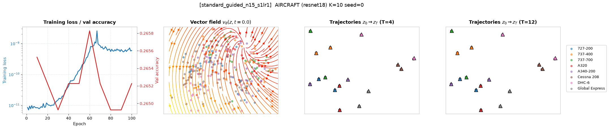
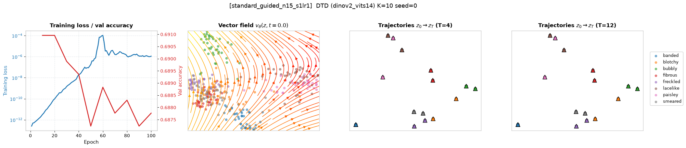

# Stage 3: FM Before a Linear Classifier

## Goal
Start from the Stage 1 linear-probe setting and insert an FM transformation before the pretrained linear classifier:
$$ z \xrightarrow{\text{FM}} \hat{z} \xrightarrow{\text{frozen linear classifier}} s $$
The goal is to test whether FM can transform the frozen encoder features into a representation that is better handled by the existing linear classifier.

## Experimental Setup
- **Datasets**: FGVC-Aircraft (ResNet-18) and DTD (DINOv2 ViT-S/14).
- **Training Subset**: $K = 10$ shots per class.
- **Euler steps**: $T = 12$.
- **Models Compared**:
  - **Stage 1 linear probe**: Direct baseline on untransported features.
  - **End-to-end rolled-out classification training** (`rolled_ce_T12`): Backpropagate through the complete $T$-step rollout and update the FM parameters via Cross-Entropy loss.
  - **Classifier-guided FM training** (`standard_guided_n15_s1lr1`): Dynamically construct targets by taking an explicit gradient step on the classification loss of $\hat{z}$, and update the FM using standard conditional optimal transport.

---

## Results to Present

### Classification Results
Top-1 test accuracy and the change relative to the corresponding linear-probe baseline for $K=10$ experiments (Seed 0).

| Dataset | Encoder | Method | Top-1 Accuracy | $\Delta$ Acc |
| --- | --- | --- | --- | --- |
| FGVC-Aircraft | ResNet-18 | Stage 1 Linear Probe | 0.2781 | - |
| FGVC-Aircraft | ResNet-18 | End-to-end Rolled-out | 0.2727 | -0.0054 |
| FGVC-Aircraft | ResNet-18 | Classifier-Guided FM | 0.2775 | -0.0006 |
| DTD | DINOv2 ViT-S/14 | Stage 1 Linear Probe | 0.6910 | - |
| DTD | DINOv2 ViT-S/14 | End-to-end Rolled-out | 0.6830 | -0.0080 |
| DTD | DINOv2 ViT-S/14 | Classifier-Guided FM | 0.6910 | +0.0000 |

### Training Behavior
Representative training and validation curves for both Stage 3 methods, alongside the vector field at $t=0$ and the flow trajectories.

**FGVC-Aircraft / ResNet-18 (Classifier-Guided FM vs Rolled-out CE)**

**DTD / DINOv2 ViT-S/14 (Classifier-Guided FM vs Rolled-out CE)**

### Feature-Space Visualization
PCA projection fitted jointly over the original and transported feature sets.

**FGVC-Aircraft / ResNet-18**

**DTD / DINOv2 ViT-S/14**

---

## Optional Extension: Jointly Fine-Tuning the Classifier
After completing the frozen-classifier experiments, we unfreezed the pretrained linear classifier and jointly optimized the FM transformation and classifier (`rolled_ce_T12_joint`).

| Dataset | Encoder | Method | Top-1 Accuracy | $\Delta$ Acc (vs Base) |
| --- | --- | --- | --- | --- |
| FGVC-Aircraft | ResNet-18 | Stage 1 Linear Probe | 0.2781 | - |
| FGVC-Aircraft | ResNet-18 | Frozen Classifier (`rolled_ce_T12`) | 0.2727 | -0.0054 |
| FGVC-Aircraft | ResNet-18 | Joint Fine-Tuning | 0.2688 | -0.0093 |
| DTD | DINOv2 ViT-S/14 | Stage 1 Linear Probe | 0.6910 | - |
| DTD | DINOv2 ViT-S/14 | Frozen Classifier (`rolled_ce_T12`) | 0.6830 | -0.0080 |
| DTD | DINOv2 ViT-S/14 | Joint Fine-Tuning | 0.6894 | -0.0016 |

**Conclusion on Joint Fine-Tuning:** Unfreezing the linear probe allows the classifier boundary to shift and perfectly memorize the training samples (leading to heavy overfitting), which distorts the test manifold and degrades performance further compared to the frozen classifier setting.
