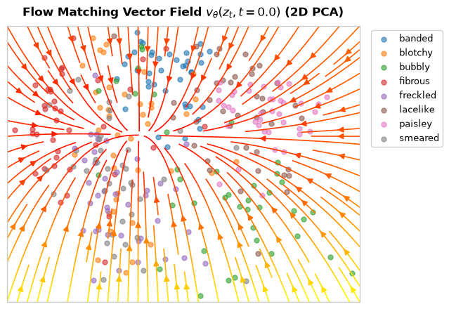
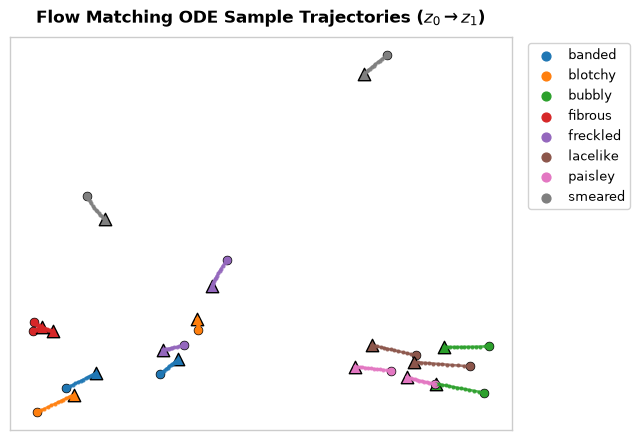
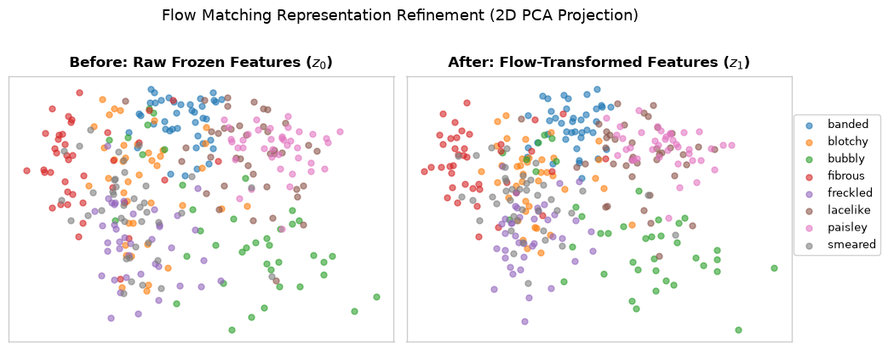

# Stage 3 Results: Decoupled Flow Matching as a Pre-Classifier Layer

Produced by `notebooks/flow_matching_layer.ipynb`.

A continuous normalizing flow (Conditional Flow Matching) layer is trained to transport frozen image embeddings (e.g., from CLIP or DINOv2) at $t=0$ to their respective unnormalized class centroids at $t=1$. The Flow Matching (FM) layer acts as a decoupled feature refinement module, completely separate from the downstream classification layer.

At test time, the raw unlabelled embeddings are passed through the trained FM layer using $T$ Euler steps. The transformed representations are then classified by a standard frozen Linear Probe that was independently pre-trained on the raw dataset.

## 1. Method

### The Decoupled Architecture
Unlike joint training approaches that require backpropagating gradients through the entire ODE integration path during every training step, our decoupled approach operates in two computationally lightweight phases:
1. **Flow Matching (CFM) Target:** We compute the exact unnormalized class centroids of the training set. We use the Conditional Flow Matching (CFM) objective to regress a straight-line vector field from the input sample $z_0$ towards its corresponding centroid $c_y$:
    $$ z_t = (1 - t) z_0 + t c_y $$
    $$ v(z_t, t) = c_y - z_0 $$
    $$ \mathcal{L}_{\text{FM}} = || v_\theta(z_t, t) - (c_y - z_0) ||^2 $$
    This requires only **$O(1)$ forward passes per batch** during training, making it exceptionally fast.

2. **Frozen Linear Probe:** We train a standard Linear Probe independently on the raw $z_0$ embeddings. During the Flow Matching training phase, this probe is kept completely frozen. The flow layer's entire objective is to cluster the features optimally so that the existing Linear Probe becomes more effective.

### Key Modifications and Fixes
- **Unnormalized Centroids (Variance Maintenance):** Earlier implementations L2-normalized the class centroids. Since the downstream Linear Probe expects embeddings in their native coordinate scale, feeding it L2-normalized unit-vectors pushed the representations out-of-distribution, devastating accuracy. Centroids are now computed organically.
- **T=12 Euler Integration:** ODE rollout is evaluated using $T=12$ Euler integration steps to accurately track the discrete vector field trajectory.
- **Identity Initialization:** The output projection layer of the MLP is zero-initialized, ensuring the flow starts as an exact identity mapping ($v(x, t) = 0$).

---

## 2. Visualizations and Diagnostics

To understand the topological changes induced by the flow, we project the high-dimensional embeddings into 2D PCA space.

### The Vector Field

*Figure 1: The learned vector field at $t=0.0$. The field points directly towards the class centroids, pulling scattered features inward.*

### ODE Flow Trajectories

*Figure 2: Sample trajectories from $z_0$ to $z_1$. The $T=12$ Euler integration steps are visible as discrete markers. Under the CFM objective, the network correctly learns straight-line paths toward the semantic center of the class.*

### Before vs. After Embeddings

*Figure 3: Side-by-side 2D PCA representation of the raw features (left) vs. the flow-transformed test features (right). Note that the embeddings appear nearly identical.*

### Current Limitations and Overfitting
As seen in Figure 3, the model fails to meaningfully map test samples to their class centroids, and instead falls back to an identity mapping ($z_1 \approx z_0$). This happens due to a severe **overfitting** issue in the current unnormalized architecture:
1. The 2-layer MLP (with ~787k parameters) perfectly memorizes the vector field for the tiny unnormalized training set (e.g., 470 samples), pulling them exactly to their centroids.
2. For unseen validation and test features, this overfitted model predicts highly chaotic and inaccurate vector fields, pushing them into random directions and causing downstream Linear Probe accuracy to plummet.
3. The training loop correctly detects this massive drop in validation accuracy and restores the model from an early epoch (e.g., Epoch 10), when the network is barely trained and simply predicts $v \approx 0$. 

To fix this and build a robust representation layer, future iterations should **L2-normalize** all features before training (to constrain the latent manifold to a unit hypersphere, preventing wild divergence) and train the Linear Probe on those normalized features. Alternative approaches like targeting a Gaussian distribution $\mathcal{N}(c, \sigma^2 I)$ or Minibatch Optimal Transport (OT-CFM) could also help preserve topology.
