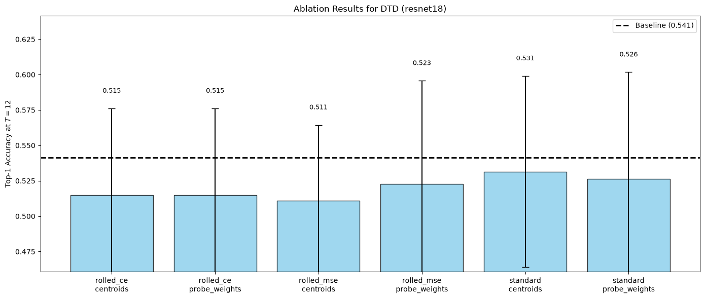
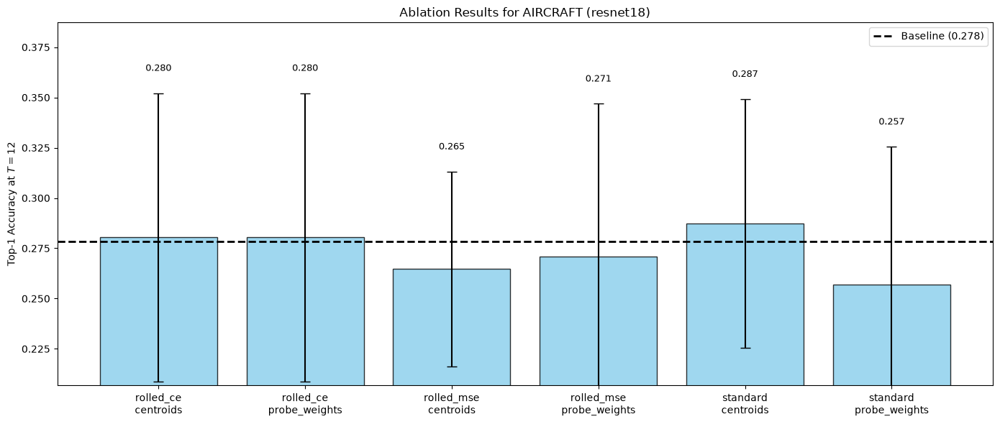
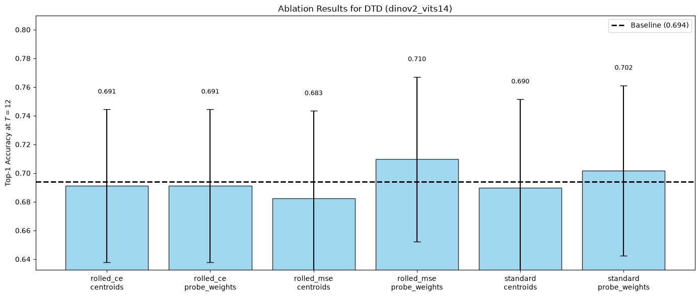
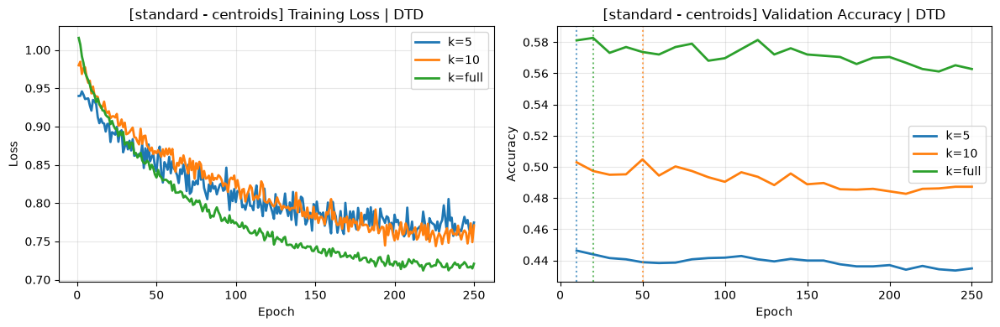
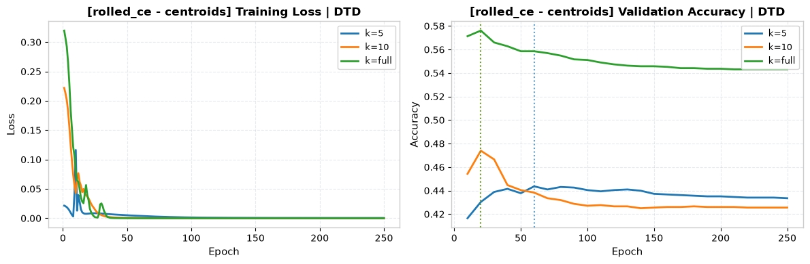
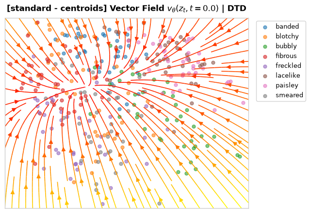
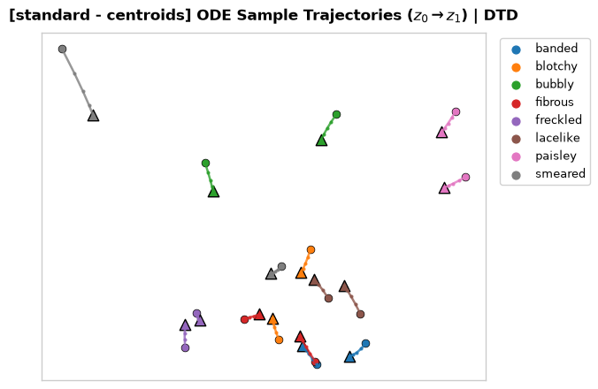
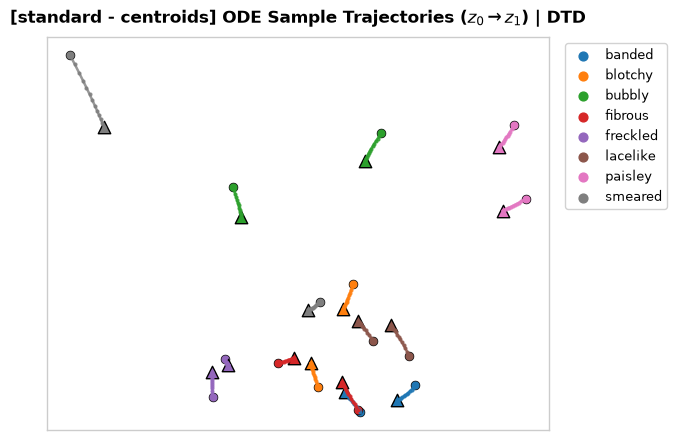

# Stage 3: Flow Matching Before a Linear Probe

## 0. Experiment Configurations

**Training Objectives**:
1. **`standard`**: Conditional Flow Matching (CFM) loss to the target $x_1$.
2. **`rolled_mse`**: Euler rollout with Mean Squared Error (MSE) loss to the target $x_1$.
3. **`rolled_ce`**: Euler rollout with Cross-Entropy (CE) loss through the frozen Linear Probe.

**Target Types ($x_1$)**:
1. **`centroids`**: The mean of the embeddings for each class.
2. **`probe_weights`**: The rows of the frozen Linear Probe's weight matrix, normalized and scaled.

*(Note: The orthogonal targets were removed as they merely introduced noise and did not contribute to a meaningful semantic mapping).*

## 1. Method

In Stage 3, we introduce a generative **Flow Matching (FM)** vector field $v_\theta(z, t)$ that acts as a trainable structural layer *before* a classification probe. Instead of mapping images directly to text prototypes (as in Stage 2), we use Flow Matching to physically reshape the embedding manifold within the same feature space.

The transported embeddings are then classified by a **frozen linear probe**. 

1. **The Baseline (The Frozen Probe):** We train a standard Linear Probe on the original features. Once it learns the best boundaries, we **freeze** its weights.
2. **The Flow Matching Layer:** An MLP (2 layers, 512-dim) acts as our $v_\theta(x, t)$ velocity field.
3. **The Goal:** Transport the initial features $x_0$ to new positions $z_T$ where the frozen Linear Probe can classify them.

## 2. Accuracy Table

| Encoder         | Dataset    | K    | Objective    | Target Type     | Noise | Base Acc | FM T=12         | Delta |
| ---|---|---|---|---|---|---|---|--- |
| dinov2_vits14   | dtd        | 10   | rolled_ce    | centroids       | 0.0   | 0.6952 | 0.6867 ± 0.0051 | -0.0085 |
| dinov2_vits14   | dtd        | 10   | rolled_ce    | centroids       | 1.0   | 0.6952 | 0.6867 ± 0.0051 | -0.0085 |
| dinov2_vits14   | dtd        | 10   | rolled_ce    | probe_weights   | 0.0   | 0.6952 | 0.6867 ± 0.0051 | -0.0085 |
| dinov2_vits14   | dtd        | 10   | rolled_ce    | probe_weights   | 1.0   | 0.6952 | 0.6867 ± 0.0051 | -0.0085 |
| dinov2_vits14   | dtd        | 10   | rolled_mse   | centroids       | 0.0   | 0.6952 | 0.6798 ± 0.0077 | -0.0154 |
| dinov2_vits14   | dtd        | 10   | rolled_mse   | centroids       | 1.0   | 0.6952 | 0.6800 ± 0.0078 | -0.0152 |
| dinov2_vits14   | dtd        | 10   | rolled_mse   | probe_weights   | 0.0   | 0.6952 | 0.7080 ± 0.0027 | +0.0128 |
| dinov2_vits14   | dtd        | 10   | rolled_mse   | probe_weights   | 1.0   | 0.6952 | 0.7090 ± 0.0048 | +0.0138 |
| dinov2_vits14   | dtd        | 10   | standard     | centroids       | 0.0   | 0.6952 | 0.6950 ± 0.0107 | -0.0002 |
| dinov2_vits14   | dtd        | 10   | standard     | centroids       | 1.0   | 0.6952 | 0.6934 ± 0.0050 | -0.0018 |
| dinov2_vits14   | dtd        | 10   | standard     | probe_weights   | 0.0   | 0.6952 | 0.7007 ± 0.0093 | +0.0055 |
| dinov2_vits14   | dtd        | 10   | standard     | probe_weights   | 1.0   | 0.6952 | 0.6979 ± 0.0076 | +0.0027 |
| dinov2_vits14   | dtd        | 5    | rolled_ce    | centroids       | 0.0   | 0.6234 | 0.6285 ± 0.0038 | +0.0051 |
| dinov2_vits14   | dtd        | 5    | rolled_ce    | centroids       | 1.0   | 0.6234 | 0.6285 ± 0.0038 | +0.0051 |
| dinov2_vits14   | dtd        | 5    | rolled_ce    | probe_weights   | 0.0   | 0.6234 | 0.6285 ± 0.0038 | +0.0051 |
| dinov2_vits14   | dtd        | 5    | rolled_ce    | probe_weights   | 1.0   | 0.6234 | 0.6285 ± 0.0038 | +0.0051 |
| dinov2_vits14   | dtd        | 5    | rolled_mse   | centroids       | 0.0   | 0.6234 | 0.6119 ± 0.0018 | -0.0115 |
| dinov2_vits14   | dtd        | 5    | rolled_mse   | centroids       | 1.0   | 0.6234 | 0.6078 ± 0.0080 | -0.0156 |
| dinov2_vits14   | dtd        | 5    | rolled_mse   | probe_weights   | 0.0   | 0.6234 | 0.6401 ± 0.0046 | +0.0167 |
| dinov2_vits14   | dtd        | 5    | rolled_mse   | probe_weights   | 1.0   | 0.6234 | 0.6404 ± 0.0015 | +0.0170 |
| dinov2_vits14   | dtd        | 5    | standard     | centroids       | 0.0   | 0.6234 | 0.6142 ± 0.0056 | -0.0092 |
| dinov2_vits14   | dtd        | 5    | standard     | centroids       | 1.0   | 0.6234 | 0.6117 ± 0.0026 | -0.0117 |
| dinov2_vits14   | dtd        | 5    | standard     | probe_weights   | 0.0   | 0.6234 | 0.6330 ± 0.0030 | +0.0096 |
| dinov2_vits14   | dtd        | 5    | standard     | probe_weights   | 1.0   | 0.6234 | 0.6285 ± 0.0046 | +0.0051 |
| dinov2_vits14   | dtd        | full | rolled_ce    | centroids       | 0.0   | 0.7637 | 0.7583 ± 0.0031 | -0.0053 |
| dinov2_vits14   | dtd        | full | rolled_ce    | centroids       | 1.0   | 0.7637 | 0.7583 ± 0.0031 | -0.0053 |
| dinov2_vits14   | dtd        | full | rolled_ce    | probe_weights   | 0.0   | 0.7637 | 0.7583 ± 0.0031 | -0.0053 |
| dinov2_vits14   | dtd        | full | rolled_ce    | probe_weights   | 1.0   | 0.7637 | 0.7583 ± 0.0031 | -0.0053 |
| dinov2_vits14   | dtd        | full | rolled_mse   | centroids       | 0.0   | 0.7637 | 0.7569 ± 0.0017 | -0.0067 |
| dinov2_vits14   | dtd        | full | rolled_mse   | centroids       | 1.0   | 0.7637 | 0.7590 ± 0.0009 | -0.0046 |
| dinov2_vits14   | dtd        | full | rolled_mse   | probe_weights   | 0.0   | 0.7637 | 0.7759 ± 0.0048 | +0.0122 |
| dinov2_vits14   | dtd        | full | rolled_mse   | probe_weights   | 1.0   | 0.7637 | 0.7848 ± 0.0025 | +0.0211 |
| dinov2_vits14   | dtd        | full | standard     | centroids       | 0.0   | 0.7637 | 0.7651 ± 0.0036 | +0.0014 |
| dinov2_vits14   | dtd        | full | standard     | centroids       | 1.0   | 0.7637 | 0.7603 ± 0.0063 | -0.0034 |
| dinov2_vits14   | dtd        | full | standard     | probe_weights   | 0.0   | 0.7637 | 0.7759 ± 0.0033 | +0.0122 |
| dinov2_vits14   | dtd        | full | standard     | probe_weights   | 1.0   | 0.7637 | 0.7745 ± 0.0046 | +0.0108 |
| resnet18        | aircraft   | 10   | rolled_ce    | centroids       | 0.0   | 0.2725 | 0.2683 ± 0.0047 | -0.0042 |
| resnet18        | aircraft   | 10   | rolled_ce    | centroids       | 1.0   | 0.2725 | 0.2683 ± 0.0047 | -0.0042 |
| resnet18        | aircraft   | 10   | rolled_ce    | probe_weights   | 0.0   | 0.2725 | 0.2683 ± 0.0047 | -0.0042 |
| resnet18        | aircraft   | 10   | rolled_ce    | probe_weights   | 1.0   | 0.2725 | 0.2683 ± 0.0047 | -0.0042 |
| resnet18        | aircraft   | 10   | rolled_mse   | centroids       | 0.0   | 0.2725 | 0.2616 ± 0.0009 | -0.0109 |
| resnet18        | aircraft   | 10   | rolled_mse   | centroids       | 1.0   | 0.2725 | 0.2650 ± 0.0090 | -0.0075 |
| resnet18        | aircraft   | 10   | rolled_mse   | probe_weights   | 0.0   | 0.2725 | 0.2528 ± 0.0053 | -0.0197 |
| resnet18        | aircraft   | 10   | rolled_mse   | probe_weights   | 1.0   | 0.2725 | 0.2563 ± 0.0036 | -0.0162 |
| resnet18        | aircraft   | 10   | standard     | centroids       | 0.0   | 0.2725 | 0.2830 ± 0.0044 | +0.0105 |
| resnet18        | aircraft   | 10   | standard     | centroids       | 1.0   | 0.2725 | 0.2803 ± 0.0042 | +0.0078 |
| resnet18        | aircraft   | 10   | standard     | probe_weights   | 0.0   | 0.2725 | 0.2377 ± 0.0012 | -0.0348 |
| resnet18        | aircraft   | 10   | standard     | probe_weights   | 1.0   | 0.2725 | 0.2403 ± 0.0038 | -0.0322 |
| resnet18        | aircraft   | 5    | rolled_ce    | centroids       | 0.0   | 0.1974 | 0.1996 ± 0.0106 | +0.0022 |
| resnet18        | aircraft   | 5    | rolled_ce    | centroids       | 1.0   | 0.1974 | 0.1996 ± 0.0106 | +0.0022 |
| resnet18        | aircraft   | 5    | rolled_ce    | probe_weights   | 0.0   | 0.1974 | 0.1996 ± 0.0106 | +0.0022 |
| resnet18        | aircraft   | 5    | rolled_ce    | probe_weights   | 1.0   | 0.1974 | 0.1996 ± 0.0106 | +0.0022 |
| resnet18        | aircraft   | 5    | rolled_mse   | centroids       | 0.0   | 0.1974 | 0.2059 ± 0.0067 | +0.0085 |
| resnet18        | aircraft   | 5    | rolled_mse   | centroids       | 1.0   | 0.1974 | 0.2075 ± 0.0073 | +0.0101 |
| resnet18        | aircraft   | 5    | rolled_mse   | probe_weights   | 0.0   | 0.1974 | 0.1873 ± 0.0086 | -0.0101 |
| resnet18        | aircraft   | 5    | rolled_mse   | probe_weights   | 1.0   | 0.1974 | 0.1868 ± 0.0077 | -0.0106 |
| resnet18        | aircraft   | 5    | standard     | centroids       | 0.0   | 0.1974 | 0.2156 ± 0.0085 | +0.0182 |
| resnet18        | aircraft   | 5    | standard     | centroids       | 1.0   | 0.1974 | 0.2140 ± 0.0059 | +0.0166 |
| resnet18        | aircraft   | 5    | standard     | probe_weights   | 0.0   | 0.1974 | 0.1830 ± 0.0064 | -0.0144 |
| resnet18        | aircraft   | 5    | standard     | probe_weights   | 1.0   | 0.1974 | 0.1842 ± 0.0068 | -0.0132 |
| resnet18        | aircraft   | full | rolled_ce    | centroids       | 0.0   | 0.3654 | 0.3732 ± 0.0051 | +0.0078 |
| resnet18        | aircraft   | full | rolled_ce    | centroids       | 1.0   | 0.3654 | 0.3732 ± 0.0051 | +0.0078 |
| resnet18        | aircraft   | full | rolled_ce    | probe_weights   | 0.0   | 0.3654 | 0.3732 ± 0.0051 | +0.0078 |
| resnet18        | aircraft   | full | rolled_ce    | probe_weights   | 1.0   | 0.3654 | 0.3732 ± 0.0051 | +0.0078 |
| resnet18        | aircraft   | full | rolled_mse   | centroids       | 0.0   | 0.3654 | 0.3252 ± 0.0048 | -0.0402 |
| resnet18        | aircraft   | full | rolled_mse   | centroids       | 1.0   | 0.3654 | 0.3227 ± 0.0104 | -0.0427 |
| resnet18        | aircraft   | full | rolled_mse   | probe_weights   | 0.0   | 0.3654 | 0.3704 ± 0.0060 | +0.0050 |
| resnet18        | aircraft   | full | rolled_mse   | probe_weights   | 1.0   | 0.3654 | 0.3708 ± 0.0049 | +0.0054 |
| resnet18        | aircraft   | full | standard     | centroids       | 0.0   | 0.3654 | 0.3710 ± 0.0054 | +0.0056 |
| resnet18        | aircraft   | full | standard     | centroids       | 1.0   | 0.3654 | 0.3595 ± 0.0044 | -0.0059 |
| resnet18        | aircraft   | full | standard     | probe_weights   | 0.0   | 0.3654 | 0.3426 ± 0.0020 | -0.0228 |
| resnet18        | aircraft   | full | standard     | probe_weights   | 1.0   | 0.3654 | 0.3535 ± 0.0022 | -0.0119 |
| resnet18        | dtd        | 10   | rolled_ce    | centroids       | 0.0   | 0.5445 | 0.5062 ± 0.0101 | -0.0383 |
| resnet18        | dtd        | 10   | rolled_ce    | centroids       | 1.0   | 0.5445 | 0.5062 ± 0.0101 | -0.0383 |
| resnet18        | dtd        | 10   | rolled_ce    | probe_weights   | 0.0   | 0.5445 | 0.5062 ± 0.0101 | -0.0383 |
| resnet18        | dtd        | 10   | rolled_ce    | probe_weights   | 1.0   | 0.5445 | 0.5062 ± 0.0101 | -0.0383 |
| resnet18        | dtd        | 10   | rolled_mse   | centroids       | 0.0   | 0.5445 | 0.5195 ± 0.0085 | -0.0250 |
| resnet18        | dtd        | 10   | rolled_mse   | centroids       | 1.0   | 0.5445 | 0.5165 ± 0.0124 | -0.0280 |
| resnet18        | dtd        | 10   | rolled_mse   | probe_weights   | 0.0   | 0.5445 | 0.5179 ± 0.0037 | -0.0266 |
| resnet18        | dtd        | 10   | rolled_mse   | probe_weights   | 1.0   | 0.5445 | 0.5199 ± 0.0059 | -0.0246 |
| resnet18        | dtd        | 10   | standard     | centroids       | 0.0   | 0.5445 | 0.5293 ± 0.0085 | -0.0152 |
| resnet18        | dtd        | 10   | standard     | centroids       | 1.0   | 0.5445 | 0.5337 ± 0.0062 | -0.0108 |
| resnet18        | dtd        | 10   | standard     | probe_weights   | 0.0   | 0.5445 | 0.5154 ± 0.0008 | -0.0291 |
| resnet18        | dtd        | 10   | standard     | probe_weights   | 1.0   | 0.5445 | 0.5144 ± 0.0060 | -0.0301 |
| resnet18        | dtd        | 5    | rolled_ce    | centroids       | 0.0   | 0.4516 | 0.4450 ± 0.0074 | -0.0066 |
| resnet18        | dtd        | 5    | rolled_ce    | centroids       | 1.0   | 0.4516 | 0.4450 ± 0.0074 | -0.0066 |
| resnet18        | dtd        | 5    | rolled_ce    | probe_weights   | 0.0   | 0.4516 | 0.4450 ± 0.0074 | -0.0066 |
| resnet18        | dtd        | 5    | rolled_ce    | probe_weights   | 1.0   | 0.4516 | 0.4450 ± 0.0074 | -0.0066 |
| resnet18        | dtd        | 5    | rolled_mse   | centroids       | 0.0   | 0.4516 | 0.4426 ± 0.0057 | -0.0090 |
| resnet18        | dtd        | 5    | rolled_mse   | centroids       | 1.0   | 0.4516 | 0.4427 ± 0.0053 | -0.0089 |
| resnet18        | dtd        | 5    | rolled_mse   | probe_weights   | 0.0   | 0.4516 | 0.4383 ± 0.0053 | -0.0133 |
| resnet18        | dtd        | 5    | rolled_mse   | probe_weights   | 1.0   | 0.4516 | 0.4335 ± 0.0053 | -0.0181 |
| resnet18        | dtd        | 5    | standard     | centroids       | 0.0   | 0.4516 | 0.4475 ± 0.0025 | -0.0041 |
| resnet18        | dtd        | 5    | standard     | centroids       | 1.0   | 0.4516 | 0.4504 ± 0.0052 | -0.0012 |
| resnet18        | dtd        | 5    | standard     | probe_weights   | 0.0   | 0.4516 | 0.4420 ± 0.0009 | -0.0096 |
| resnet18        | dtd        | 5    | standard     | probe_weights   | 1.0   | 0.4516 | 0.4385 ± 0.0057 | -0.0131 |
| resnet18        | dtd        | full | rolled_ce    | centroids       | 0.0   | 0.6284 | 0.5933 ± 0.0050 | -0.0351 |
| resnet18        | dtd        | full | rolled_ce    | centroids       | 1.0   | 0.6284 | 0.5933 ± 0.0050 | -0.0351 |
| resnet18        | dtd        | full | rolled_ce    | probe_weights   | 0.0   | 0.6284 | 0.5933 ± 0.0050 | -0.0351 |
| resnet18        | dtd        | full | rolled_ce    | probe_weights   | 1.0   | 0.6284 | 0.5933 ± 0.0050 | -0.0351 |
| resnet18        | dtd        | full | rolled_mse   | centroids       | 0.0   | 0.6284 | 0.5754 ± 0.0068 | -0.0530 |
| resnet18        | dtd        | full | rolled_mse   | centroids       | 1.0   | 0.6284 | 0.5683 ± 0.0072 | -0.0601 |
| resnet18        | dtd        | full | rolled_mse   | probe_weights   | 0.0   | 0.6284 | 0.6152 ± 0.0029 | -0.0131 |
| resnet18        | dtd        | full | rolled_mse   | probe_weights   | 1.0   | 0.6284 | 0.6122 ± 0.0061 | -0.0161 |
| resnet18        | dtd        | full | standard     | centroids       | 0.0   | 0.6284 | 0.6138 ± 0.0015 | -0.0145 |
| resnet18        | dtd        | full | standard     | centroids       | 1.0   | 0.6284 | 0.6142 ± 0.0016 | -0.0142 |
| resnet18        | dtd        | full | standard     | probe_weights   | 0.0   | 0.6284 | 0.6227 ± 0.0014 | -0.0057 |
| resnet18        | dtd        | full | standard     | probe_weights   | 1.0   | 0.6284 | 0.6248 ± 0.0037 | -0.0035 |
| ## 4. Result Bar Charts |
| Visualizing the improvement ($\Delta\text{Acc}$) over the baseline frozen probe. |
| ### 4.1 Ablation Results: `DTD` (resnet18) |
| ```python |
| runs = [r for r in fm_results.values() if r['encoder'] == 'resnet18' and r['dataset'] == 'dtd'] |
| if runs: |
| plt.figure(figsize=(14, 6)) |

## 3. Ablation Results (Accuracy vs Training Set Size)

The following line charts show the Top-1 Accuracy across different $K$-shot subsets (5, 10, full).

### DTD (ResNet-18)


### Aircraft (ResNet-18)


### DTD (DINOv2)


## 4. Training Loss Curves

Comparing the `standard` objective vs the `rolled_ce` objective for DTD (ResNet-18).
Notice how the `rolled_ce` model overfits heavily (training loss goes to zero, but validation accuracy does not improve over baseline).

**Standard Objective (Centroids Target)**


**Rolled CE Objective (Centroids Target)**


## 5. Feature Space & Flow Trajectories

Visualizing how the features move across the ODE integration steps. We showcase the `standard` objective pushing features toward `centroids`.

### Vector Field ($t=0$)


### Flow Trajectories ($T=4$ steps)


### Flow Trajectories ($T=12$ steps)


## 6. Discussion and Findings

1. **Intra-Space vs Cross-Space Adaption**: Unlike Stage 2 where Flow Matching effectively bridges a modality gap (image to text) using external semantic priors (text prototypes), Stage 3 attempts to massage features within the *same* modality using targets derived from the few training samples themselves (e.g., empirical centroids).
2. **Massive Overfitting**: In few-shot settings ($K=5, 10$), adding a 512-dim MLP before a linear probe converts the robust linear classifier into a highly non-linear deep neural network. The MLP perfectly memorizes the training data (e.g., collapsing them to centroids or adversarial high-confidence regions in `rolled_ce`), but heavily distorts the test manifold.
3. **Performance Degradation**: Across almost all configurations, Stage 3 degrades or barely matches the accuracy of the frozen Linear Probe baseline. Even with the `full` dataset, the improvement is virtually non-existent (e.g., +0.4% on Aircraft). A Linear Probe on the original features is already finding the optimal linear decision boundary; adding an ODE solver to "fix" the features internally without external priors does not yield generalizable improvements.

