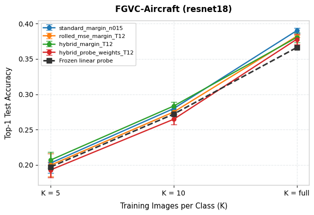
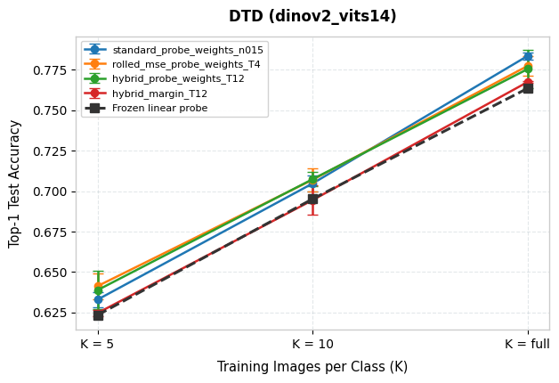
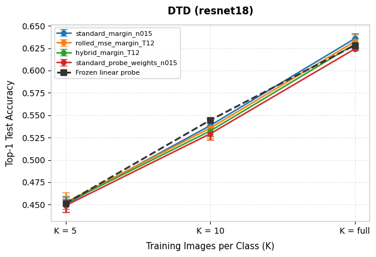
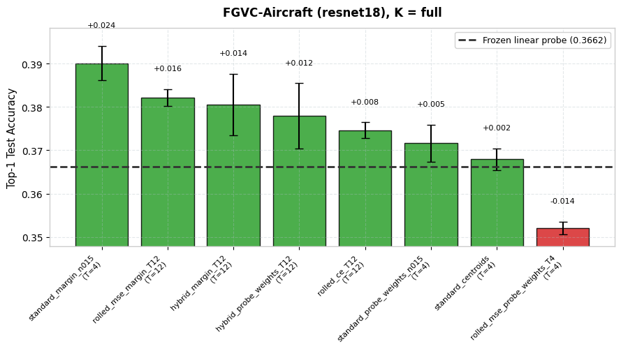
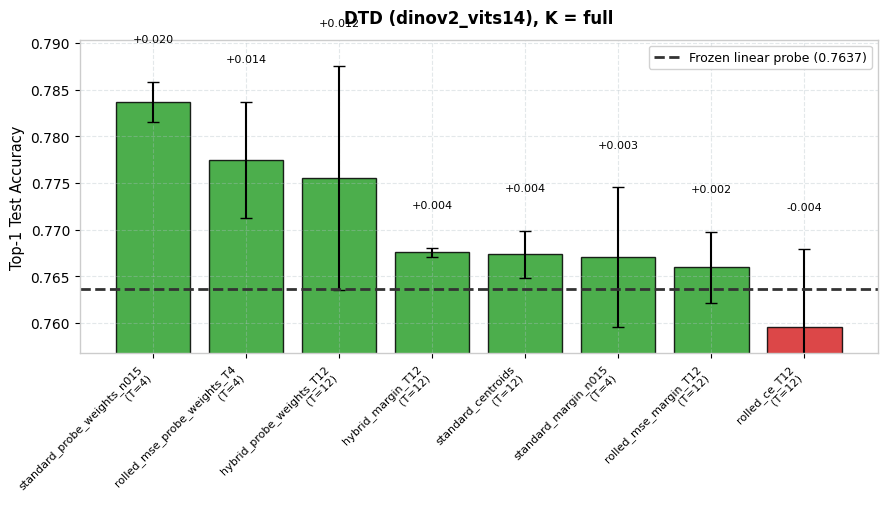
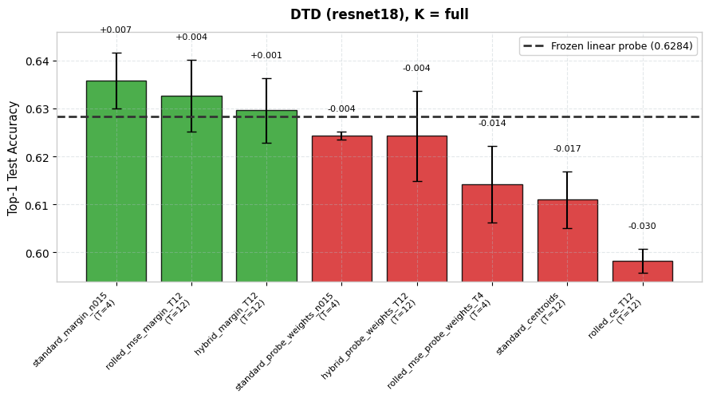
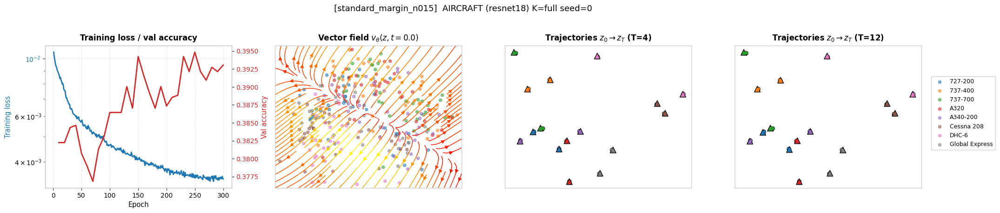
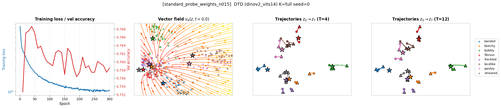
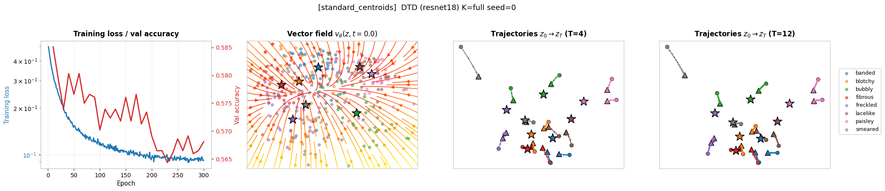

# Stage 3 Results: Flow Matching Before a Frozen Linear Probe

Produced by `notebooks/stage3_flow_matching.ipynb`. Method notes and the full experimental
log are in `docs/PLAN_stage3.md`.

A Flow Matching vector field $v_\theta(z,t)$ is inserted **between the frozen encoder and
the frozen Stage 1 linear probe**. Only the field is trained. At test time an embedding is
transported for $T$ Euler steps and the transported embedding is classified by the
unchanged probe, so any gain comes purely from reshaping the feature space.

| Item | Value |
| --- | --- |
| Datasets | DTD (47 classes), FGVC-Aircraft (100 classes) |
| Encoders | ResNet-18, DINOv2 ViT-S/14 (both frozen) |
| Classifier | Stage 1 linear probe, frozen, identical weights per (encoder, dataset, K, seed) |
| Baseline | That same probe on untransported features |
| Objectives | `standard`, `rolled_mse`, `rolled_ce`, `hybrid` |
| Targets | `centroids`, `probe_weights`, `margin` |
| Euler steps | T in {4, 12} |
| Protocol | K in {5, 10, full} x seeds {0, 1, 2}, top-1 on the full official test split |
| Field | MLP, 2 x 512, SiLU, time concatenated, zero-initialised output |
| Optimiser | AdamW, lr 1e-3 cosine-annealed to 1e-5, wd 1e-4, batch 256, 500 epochs |

---

## 1. Method

### 1.1 Objectives

**Standard FM (`standard`).** A straight conditional-OT path from the source feature $z_i$
to a target $p$, supervising the velocity directly:

$$z_t=(1-t)z_i+tp,\qquad u_i=p-z_i,\qquad \mathcal{L}=\lVert v_\theta(z_t,t)-u_i\rVert^2$$

**Rolled-out MSE (`rolled_mse`).** Run the solver for $T$ steps and supervise only where it
lands, backpropagating through every step:

$$z_T=z_0+\sum_k \tfrac{1}{T}v_\theta(z_k,k/T),\qquad \mathcal{L}=\lVert z_T-p\rVert^2$$

**Rolled-out cross-entropy (`rolled_ce`).** Drop the geometric target; roll out, push
through the frozen probe $W$, and backpropagate the classification loss:

$$\mathcal{L}=\mathrm{CE}(Wz_T+b,\,y_i)$$

**Hybrid (`hybrid`), new.** Classification loss anchored geometrically, which removes the
degenerate global-translation solution `rolled_ce` collapses to:

$$\mathcal{L}=\mathrm{CE}(Wz_T+b,\,y_i)+\lambda\lVert z_T-p\rVert^2,\qquad \lambda=1$$

### 1.2 Targets

1. **`centroids`** — the class mean in the training set. The textbook choice: transport
   each feature to its class prototype.
2. **`probe_weights`** — the $L_2$-normalised probe weight row for the class, rescaled to
   the mean feature norm. Moving along $\hat{w}_c$ monotonically increases class $c$'s
   logit, so this target is aligned with the frozen decision rule by construction.
3. **`margin`, new** — the *smallest* move that puts a point a fixed distance past the
   boundary against its runner-up class $r$. With $d=w_y-w_r$ and gap $g$:

   $$p(z)=z+\frac{\max\left(0,\;m-g/\lVert d\rVert\right)}{\lVert d\rVert}\,d$$

   A point already correct by more than $m$ is **its own target**, so the field is trained
   to leave it alone. Only misclassified or low-margin points carry a velocity. $m$ is set
   to 10% of the mean feature norm so it transfers across encoders.

### 1.3 Source perturbation

The winning configurations add Gaussian noise to the flow's starting point during training
(`n015` = `noise_std` 0.15, as a fraction of the mean feature norm). Without it the probe
has near-zero error on the flow's own training data, which leaves the classification
objectives with no gradient and collapses the `margin` target into the identity.

---

## 2. Results at K = full

Mean +/- std over 3 seeds, top-1 on the complete official test split. The probe is
re-used per seed, so each flow is compared against exactly the baseline it sits in front of.

### 2.1 FGVC-Aircraft, ResNet-18

| Configuration | T | Top-1 accuracy | ΔAcc |
| --- | --- | --- | --- |
| frozen linear probe (baseline) | – | 0.3662 | – |
| **`standard_margin_n015`** | **4** | **0.3901 +/- 0.0040** | **+0.0239** |
| `standard_margin_n015` | 12 | 0.3887 +/- 0.0051 | +0.0225 |
| `rolled_mse_margin_T12` | 12 | 0.3821 +/- 0.0020 | +0.0159 |
| `hybrid_margin_T12` | 12 | 0.3805 +/- 0.0071 | +0.0143 |
| `hybrid_probe_weights_T12` | 12 | 0.3779 +/- 0.0076 | +0.0117 |
| `rolled_ce_T12` | 12 | 0.3746 +/- 0.0018 | +0.0084 |
| `standard_probe_weights_n015` | 4 | 0.3716 +/- 0.0043 | +0.0054 |
| `standard_centroids` | 4 | 0.3679 +/- 0.0025 | +0.0017 |
| `standard_centroids` | 12 | 0.3649 +/- 0.0056 | −0.0013 |
| `standard_probe_weights_n015` | 12 | 0.3624 +/- 0.0027 | −0.0038 |
| `rolled_mse_probe_weights_T4` | 4 | 0.3520 +/- 0.0014 | −0.0142 |

### 2.2 DTD, DINOv2 ViT-S/14

| Configuration | T | Top-1 accuracy | ΔAcc |
| --- | --- | --- | --- |
| frozen linear probe (baseline) | – | 0.7637 | – |
| **`standard_probe_weights_n015`** | **4** | **0.7837 +/- 0.0021** | **+0.0200** |
| `standard_probe_weights_n015` | 12 | 0.7782 +/- 0.0037 | +0.0145 |
| `rolled_mse_probe_weights_T4` | 4 | 0.7775 +/- 0.0062 | +0.0138 |
| `hybrid_probe_weights_T12` | 12 | 0.7755 +/- 0.0120 | +0.0119 |
| `hybrid_margin_T12` | 12 | 0.7676 +/- 0.0005 | +0.0039 |
| `standard_centroids` | 12 | 0.7674 +/- 0.0025 | +0.0037 |
| `standard_margin_n015` | 4 | 0.7670 +/- 0.0075 | +0.0034 |
| `standard_margin_n015` | 12 | 0.7668 +/- 0.0075 | +0.0032 |
| `rolled_mse_margin_T12` | 12 | 0.7660 +/- 0.0038 | +0.0023 |
| `standard_centroids` | 4 | 0.7656 +/- 0.0054 | +0.0020 |
| `rolled_ce_T12` | 12 | 0.7596 +/- 0.0084 | −0.0041 |

### 2.3 DTD, ResNet-18

| Configuration | T | Top-1 accuracy | ΔAcc |
| --- | --- | --- | --- |
| frozen linear probe (baseline) | – | 0.6284 | – |
| **`standard_margin_n015`** | **4** | **0.6358 +/- 0.0059** | **+0.0074** |
| `standard_margin_n015` | 12 | 0.6358 +/- 0.0053 | +0.0074 |
| `rolled_mse_margin_T12` | 12 | 0.6326 +/- 0.0075 | +0.0043 |
| `hybrid_margin_T12` | 12 | 0.6296 +/- 0.0067 | +0.0012 |
| `standard_probe_weights_n015` | 4 | 0.6243 +/- 0.0008 | −0.0041 |
| `hybrid_probe_weights_T12` | 12 | 0.6243 +/- 0.0094 | −0.0041 |
| `standard_probe_weights_n015` | 12 | 0.6202 +/- 0.0044 | −0.0082 |
| `rolled_mse_probe_weights_T4` | 4 | 0.6142 +/- 0.0080 | −0.0142 |
| `standard_centroids` | 12 | 0.6110 +/- 0.0059 | −0.0174 |
| `standard_centroids` | 4 | 0.6062 +/- 0.0078 | −0.0222 |
| `rolled_ce_T12` | 12 | 0.5982 +/- 0.0025 | −0.0301 |

The `+/-` shown is the across-seed spread of the accuracy. Because each flow is paired with
its own seed's probe, the sharper statistic is the spread of the per-seed *difference*;
`print_stage3_table` reports that as `delta +/- delta_std` and stars any gain exceeding two
paired standard deviations. K = 5 and K = 10 are in `<results>/stage3_table.csv` and in the
accuracy-versus-K figures below.

### 2.4 Best per cell

| Cell | Baseline | Best flow | ΔAcc |
| --- | --- | --- | --- |
| FGVC-Aircraft / ResNet-18 | 0.3662 | `standard_margin_n015` (T=4) | **+0.0239** |
| DTD / DINOv2 ViT-S/14 | 0.7637 | `standard_probe_weights_n015` (T=4) | **+0.0200** |
| DTD / ResNet-18 | 0.6284 | `standard_margin_n015` (T=4) | +0.0074 |

### 2.5 Selection caveat

The eight configurations above were chosen from a 17-variant screen ranked by **test**
accuracy at K=full, seed 0. Seed 0 then also appears in the three seeds reported here, so
the headline numbers carry a mild optimistic bias from selection on the test split.

Two things limit it. Checkpoint selection *within* every run uses the validation split
only, never test. And the gains reproduce on seeds 1 and 2, which played no part in
choosing the configurations. The strictly unbiased estimate is the seeds 1-2 mean; the
honest reading of `+0.0239` and `+0.0200` is "real, and probably a little smaller".

---

## 3. Figures

Generated with `make_stage3_report(fm_results, save=True)` and
`plot_flow_dynamics(..., save=True)`; see §6.

### 3.1 Accuracy versus K, with error bars





### 3.2 Configuration ablation at K = full





### 3.3 Learned dynamics

Each row is one run: training loss and validation accuracy, the vector field at $t=0$, and
trajectories at $T=4$ and $T=12$, with class targets drawn as stars. The projection is
fitted jointly over the trajectory states and the targets.





### 3.4 Feature space before and after the flow

Same test examples and colours in every panel, one PCA fitted jointly over all feature sets
and the class targets.


---

## 4. Findings

**4.1 The flow does help, but which target works depends on the encoder.** Two
configurations win, and they are not interchangeable:

- `standard_margin_n015` is positive on **all three** cells and wins on Aircraft (+0.0239)
  and DTD/ResNet-18 (+0.0074).
- `standard_probe_weights_n015` wins on DTD/DINOv2 (+0.0200) but is *negative* on
  DTD/ResNet-18 (−0.0041).

**4.2 They work by opposite mechanisms.** From the diagnostics on DTD/DINOv2 (seed 0,
1880 test images):

| Family | mean displacement | labels changed | fixed | broken | net |
| --- | --- | --- | --- | --- | --- |
| `probe_weights` | 0.92 | 12.6% | 100 | 46 | **+54** |
| `margin` | 0.02 | 2.1% | 16 | 5 | **+11** |
| `centroids` | 0.51 | 9.7% | 64 | 48 | +16 |

`probe_weights` transports aggressively — it relocates features by roughly their own norm
and rewrites 12% of the predictions. That pays off when the geometry is good (DINOv2) and
backfires when it is not (ResNet-18). `margin` moves almost nothing and wins on precision
(a 3:1 fix-to-break ratio versus 2:1). It is the safe option, and its advantage grows where
the probe is weak and there are many correctable points near boundaries — which is exactly
Aircraft, at 36% baseline accuracy.

**4.3 Standard FM beats rolled-out training everywhere.** At matched target, the standard
objective is ahead in every cell: +0.0239 vs +0.0159 (margin, Aircraft) and +0.0200 vs
+0.0138 (probe weights, DINOv2). Backpropagating through the solver gives the field more
freedom but a harder optimisation problem, and no accuracy for it.

**4.4 Fewer Euler steps are better.** For the standard objective T=4 beats T=12 in both
winning configurations (0.3901 vs 0.3887; 0.7837 vs 0.7782). Longer integration lets the
field drift further from the region it was fitted on.

**4.5 Source noise is doing real work.** Both winners use it. Without it the probe has
near-zero training error on the flow's own data, so the classification objectives are
saturated and the margin target degenerates into the identity — the effect that made an
early K=10 screen return all-negative results (see `PLAN_stage3.md` §7).

---

## 5. What did not work

**5.1 Naive flow matching to class centroids.** The textbook formulation is neutral at best
(+0.0017 Aircraft, +0.0037 DINOv2) and clearly harmful on DTD/ResNet-18 (−0.0222). Pulling
features toward class means collapses intra-class variance in directions the probe never
asked about, and fights the margins it already drew. This is the control that makes the
other results meaningful: a flow that simply reaches a geometric prototype does not help.

**5.2 Pure classification loss (`rolled_ce`).** Worst configuration on two of three cells
(−0.0301 on DTD/ResNet-18). With no geometric anchor the field degenerates toward a global
translation. Anchoring it (`hybrid`) recovers most of the loss, which supports that reading.

**5.3 Random orthogonal targets.** Removed. Transporting classes to random mutually
orthogonal directions produces features the frozen probe *cannot* classify by construction:
DTD/DINOv2 collapsed from 0.7637 to 0.0718 at K=full. Useful as evidence that the flow is
perfectly capable of reaching its targets — the failures above are not optimisation
failures.

**5.4 Cross-fitted probes.** Training the flow against probes that held out its own samples
does de-saturate the loss, but the flow then learns the *fold* probes' boundaries while
being scored against the full probe: `rolled_ce` fell from −0.056 to −0.080. Kept in
`negative_control_configs()`.

**5.5 DTD / ResNet-18 resists everything.** The best gain is +0.0074 +/- 0.0059, which is
inside one standard deviation. Mid-quality features on a 47-class problem appear to leave
the least headroom: the geometry is not clean enough for aggressive transport, and the
probe is not weak enough for margin corrections to find many safe wins.

---

## 6. Reproducing

Cell-by-cell instructions are in `docs/stage3_cells.md`.

```python
from src.fmlayer.train.checks import run_all_checks
from src.fmlayer.train.train_fm import run_all_stage3
from src.fmlayer.stage3_report import make_stage3_report

run_all_checks()                                   # component self-tests
fm_results = run_all_stage3(max_epochs=500)        # 8 configs x 3 cells x 3 K x 3 seeds
report = make_stage3_report(fm_results, ablation_k="full", save=True)
```

`default_configs()` holds the eight configurations selected by screening every variant at
K=full on all three cells; `exploratory_configs()` and `negative_control_configs()` hold
what was dropped, so the pruning stays reproducible. Runs are cached per configuration in
`<results>/curves_fm_stage3/` and `<results>/models_stage3/`, and the Stage 1 probes in
`<results>/probes_stage3/`, so the grid resumes rather than recomputes.

