# Stage 3: FM Before a Linear Classifier

## Goal

Insert a flow-matching transformation between the frozen encoder feature and the
pretrained linear classifier:

$$ z \xrightarrow{\ \text{FM}\ } \hat{z} \xrightarrow{\ \text{frozen linear classifier}\ } s $$

where $z$ is the frozen image-encoder feature, $\hat{z}$ is the feature after the FM
transformation and $s = W\hat{z} + b$ are the classifier logits. The question is whether
the FM layer can reshape the frozen representation into one the *existing* classifier
handles better.

## Experimental setup

**Protocol.** The linear classifier is trained first, exactly as in Stage 1, and is then
**frozen**: its parameters are set to `requires_grad = False` and never enter the
optimiser. The FM layer is initialised at the **exact identity** — the output projection of
the velocity network is zero-initialised, so $v_\theta \equiv 0$ and $\hat{z} = z$ before
any Stage 3 training. The complete system therefore starts out numerically identical to
the Stage 1 linear probe, and every reported change is caused by Stage 3 training alone.
Both properties are asserted by the component checks in `src/fmlayer/train/checks.py`.

**Data.** The same splits and the same sampled training subsets as the Stage 1 linear-probe
experiments; the subset index files are reused from the cache, keyed by
`(dataset, K, seed)`, so the flow and the Stage 1 probe see exactly the same images.

| | |
| --- | --- |
| Datasets / encoders | FGVC-Aircraft + ResNet-18; DTD + DINOv2 ViT-S/14 |
| Training-set size | $K = 10$ shots per class (secondary table at $K = \text{full}$) |
| Euler steps | $T = 12$, used identically in training, model selection and evaluation |
| Seeds | 0, 1, 2 |
| Test-set size | 3333 images (Aircraft), 1880 images (DTD) |
| Baseline | the Stage 1 linear probe of the same encoder, subset and seed |

**Velocity network.** Same design and integration procedure as Stage 2: an MLP
$v_\theta(z, t)$ with 2 hidden layers of width 512 and SiLU activations, the scalar time
concatenated to the input. Features are standardised on the way in and the predicted
velocity is rescaled by the same per-dimension spread on the way out, so the network
optimises in a well-conditioned space while the ODE runs in the original feature space.
Integration is explicit Euler, $z_{k+1} = z_k + \tfrac{1}{T} v_\theta(z_k, k/T)$.

**Optimisation.** AdamW, learning rate $10^{-3}$, weight decay $10^{-4}$, cosine schedule
down to $10^{-5}$, batch size 256, 500 epochs. Validation is evaluated every 10 epochs and
the checkpoint with the best validation accuracy is kept; the test set is touched once, at
the end, by that checkpoint only.

**Why $T = 12$.** Stage 2 found the accuracy of the transported features flat between
$T = 4$ and $T = 12$ while the discretisation error keeps shrinking, so 12 is the cheapest
count at which the Euler solution is a faithful stand-in for the continuous flow. It is
fixed once and used everywhere in Stage 3.

## Methods compared

| Name in the tables | Configuration tag | What it does |
| --- | --- | --- |
| Stage 1 linear probe | — | The frozen baseline; the FM layer is the identity. |
| End-to-end rolled-out | `rolled_ce_T12` | Strategy 1. Run the full $T$-step rollout, score $\hat{z}$ with the frozen classifier and minimise $\mathcal{L}_{cls} = \mathrm{CE}(W\hat{z} + b,\, y)$, backpropagating through **every** Euler step. Only the FM parameters are updated. |
| Classifier-guided FM | `standard_guided_T12_s1lr0p1` | Strategy 2. Transport $z$ to $\hat{z}$, take a gradient step on the classification loss in feature space to get $\hat{z}'$, then perform a **standard** conditional-OT FM update from source $z$ to target $\hat{z}'$. Targets are recomputed every batch as the flow changes. |
| Classifier-guided FM, noised sources | `standard_guided_T12_n0p15_s1lr0p1` | The same, with the source perturbed by Gaussian noise (see *Deviations*). |
| Joint fine-tuning | `rolled_ce_T12_joint` | Optional extension: the classifier is unfrozen and trained together with the FM layer. |

**Reading the tags.** `T12` is the number of Euler steps; `s1` is one target-improvement
step; `lr0p1` is a feature-space step size of $0.1$; `n0p15` is source noise with standard
deviation $0.15$ of the mean feature norm. Every knob that changes the trained model
appears in the tag, so no two variants can share a checkpoint.

## Deviations from the suggested recipes

The brief asks that substantial changes be described and justified experimentally.

1. **Noise-perturbed sources for the guided method.** At $K = 10$ the frozen probe has
   essentially zero training error, so on the training features themselves the
   classification loss is already saturated and its gradient — the signal Strategy 2 is
   built on — is close to zero. Perturbing the source with Gaussian noise
   ($\sigma = 0.15$ of the mean feature norm) puts the flow on points the probe has not
   memorised. Because this is a deviation, the **clean** variant is reported alongside it
   rather than replaced by it, so the effect is measured rather than assumed.
2. **Checkpoint selection on validation accuracy.** Both methods keep their best
   validation checkpoint, as does the Stage 1 baseline, so the comparison is like for like.
3. **Cross-fitting was tried and rejected.** Training the flow against held-out fold probes
   de-saturates the loss, but the flow then learns the fold probes' boundaries while being
   scored against the full probe, so the corrections aim at the wrong decision surface. It
   is kept as a documented negative control, not used in the main comparison.

---

## Results

### Classification results

Top-1 test accuracy at $K = 10$, $T = 12$, averaged over seeds 0/1/2. The delta is a
**paired** difference: each run is scored against the Stage 1 probe of its own seed, so the
spread of the delta is the correct error bar rather than the spread of accuracy.

| Dataset | Encoder | Method | Top-1 accuracy | Delta vs probe |
| --- | --- | --- | --- | --- |
| FGVC-Aircraft | ResNet-18 | Stage 1 linear probe (frozen) | 0.2720 +/- 0.0056 | - |
| FGVC-Aircraft | ResNet-18 | End-to-end rolled-out (Strategy 1) | 0.2601 +/- 0.0079 | -0.0119 +/- 0.0073 |
| FGVC-Aircraft | ResNet-18 | Classifier-guided FM (Strategy 2) | 0.2745 +/- 0.0041 | +0.0025 +/- 0.0050 |
| FGVC-Aircraft | ResNet-18 | Classifier-guided FM, noised sources | 0.2746 +/- 0.0041 | +0.0026 +/- 0.0027 |
| FGVC-Aircraft | ResNet-18 | Joint fine-tuning (extension) | 0.2627 +/- 0.0093 | -0.0093 +/- 0.0087 |
| DTD | DINOv2 ViT-S/14 | Stage 1 linear probe (frozen) | 0.6952 +/- 0.0073 | - |
| DTD | DINOv2 ViT-S/14 | End-to-end rolled-out (Strategy 1) | 0.6876 +/- 0.0038 | -0.0076 +/- 0.0077 |
| DTD | DINOv2 ViT-S/14 | Classifier-guided FM (Strategy 2) | 0.6970 +/- 0.0062 | +0.0017 +/- 0.0026 |
| DTD | DINOv2 ViT-S/14 | Classifier-guided FM, noised sources | 0.6926 +/- 0.0138 | -0.0027 +/- 0.0079 |
| DTD | DINOv2 ViT-S/14 | Joint fine-tuning (extension) | 0.6924 +/- 0.0046 | -0.0029 +/- 0.0035 |

**No delta clears twice its paired standard deviation**, so none of the four methods is a
statistically supported change at $K = 10$. What the signs do show consistently is a
direction: the rolled-out objective is negative on 5 of 6 runs (and zero on the sixth), the
joint extension is negative on 5 of 6, and the classifier-guided objective is non-negative
on 5 of 6. A delta of $0.0025$ on Aircraft is 8 test images out of 3333.

### Why: the frozen probe supplies almost no gradient

Both strategies learn only from $\nabla_{\hat z}\,\mathrm{CE}$ evaluated at the training
features. The table below measures that signal directly on the $K = 10$ subsets, for
increasing source perturbation $\sigma$ (as a fraction of the mean feature norm).
`step/|z|` is the fraction of its own norm that one classifier-guided target step moves a
feature.

| Cell | $\sigma$ | Train acc | Train CE | mean $\lVert\nabla\rVert$ | step/$\lVert z\rVert$ |
| --- | --- | --- | --- | --- | --- |
| Aircraft / ResNet-18 | 0.00 | 1.0000 | 2.22e-02 | 7.41e-02 | 2.63e-04 |
| Aircraft / ResNet-18 | 0.30 | 0.9990 | 8.21e-02 | 2.57e-01 | 8.71e-04 |
| Aircraft / ResNet-18 | 0.50 | 0.8960 | 3.58e-01 | 7.57e-01 | 2.38e-03 |
| Aircraft / ResNet-18 | 1.00 | 0.4770 | 2.57e+00 | 2.30e+00 | 5.64e-03 |
| DTD / DINOv2 | 0.00 | 1.0000 | 1.75e-03 | 1.73e-03 | 3.62e-06 |
| DTD / DINOv2 | 0.30 | 1.0000 | 2.83e-03 | 2.89e-03 | 5.78e-06 |
| DTD / DINOv2 | 0.50 | 1.0000 | 4.64e-03 | 4.68e-03 | 8.74e-06 |
| DTD / DINOv2 | 1.00 | 0.9894 | 5.48e-02 | 4.41e-02 | 6.60e-05 |

The probe is at **100% training accuracy on both cells**, and one guided step moves a DTD
feature by $3.6\times10^{-6}$ of its norm — numerically indistinguishable from not moving
it. This is the identity collapse, quantified: it is a property of the $K = 10$ setting,
not a training failure. DINOv2 is the more extreme case by an order of magnitude, and it
also resists perturbation: even at $\sigma = 1.0$ the probe is still 98.9% correct on the
perturbed sources, whereas ResNet-18 has fallen to 47.7%.

This is also the explanation for the one configuration that did work (below): it is the
only one that pushes $\sigma$ far enough to manufacture real classifier errors.

### Escaping the saturation

Seed 0 only, so these are leads rather than results. Deltas against the same frozen probe.

| Configuration | Aircraft / ResNet-18 | DTD / DINOv2 |
| --- | --- | --- |
| `rolled_ce_T12` (Strategy 1, reference) | -0.0105 | -0.0074 |
| `rolled_ce_T12_n1` (source noise $\sigma = 1$) | **+0.0033** | **+0.0176** |
| `rolled_ce_T12_vl1` (velocity penalty) | +0.0066 | -0.0043 |
| `rolled_ce_T12_dl0p1` (displacement penalty) | +0.0051 | -0.0037 |
| `standard_margin_n0p15` | +0.0045 | -0.0005 |
| `rolled_mse_probe_weights_T12` | -0.0306 | **+0.0117** |
| `standard_guided_T12_s1lr1` | +0.0027 | +0.0016 |
| `standard_guided_T12_s1lr0p15_norm` | +0.0009 | +0.0027 |

Two things stand out. First, **every one of the brief's suggested regularisers repairs the
rolled-out objective**: all four settings beat the unregularised `rolled_ce_T12` on both
cells, by $+0.0031$ to $+0.0171$, turning Aircraft from $-0.0105$ to $+0.0066$. Second,
**strong source perturbation is the only change that produces a clear gain**, $+0.0176$ on
DTD/DINOv2.

The flow diagnostics confirm that this gain is real transport rather than noise:

| Cell | Configuration | Delta | move | flip% | fixed | broken | net |
| --- | --- | --- | --- | --- | --- | --- | --- |
| DTD / DINOv2 | `rolled_ce_T12_n1` | +0.0176 | 0.303 | 12.3% | 86 | 53 | +33 |
| DTD / DINOv2 | `rolled_mse_probe_weights_T12` | +0.0117 | 0.821 | 14.1% | 84 | 62 | +22 |
| Aircraft / RN18 | `standard_margin_n0p15` | +0.0045 | 0.025 | 15.4% | 77 | 62 | +15 |
| Aircraft / RN18 | `rolled_ce_T12_n1` | +0.0033 | 0.039 | 13.2% | 55 | 44 | +11 |
| Aircraft / RN18 | `standard_probe_weights_n0p15` | -0.0282 | 0.891 | 51.5% | 170 | 264 | -94 |
| Aircraft / RN18 | `rolled_mse_probe_weights_T12` | -0.0306 | 1.129 | 60.9% | 211 | 313 | -102 |

`move` is the mean relative displacement, `fixed` counts wrong-to-right label flips and
`broken` right-to-wrong. The winning configuration moves features a substantial 30% of
their norm and fixes 86 test images while breaking 53. The probe-weight target is the
mirror image on Aircraft: it moves features more than their own norm and breaks 313.

<!-- Replace this section with the three-seed table from cell 6.8 before presenting. -->

### Training behaviour

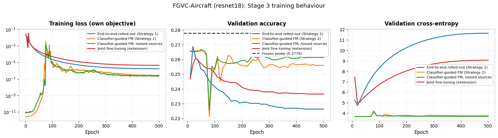
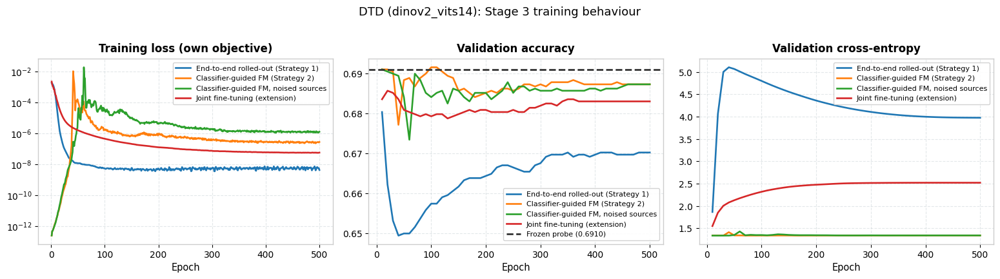

Three panels per cell: training loss, validation accuracy and validation cross-entropy.

**The training losses of the two methods are different quantities** — Strategy 1 minimises
the classifier's cross-entropy while Strategy 2 minimises a flow-matching MSE against a
moving target — so the left panel is only meaningful *within* a method. The two right-hand
panels are the frozen classifier's own metrics on the validation split and are what the
methods should be compared on.

Per-method dynamics, each showing the training and validation curves, the learned vector
field at $t = 0$ and the trajectories $z_0 \rightarrow z_T$ at $T = 12$:

**FGVC-Aircraft / ResNet-18**
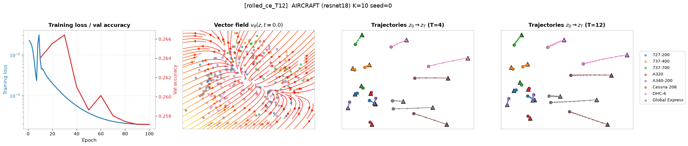
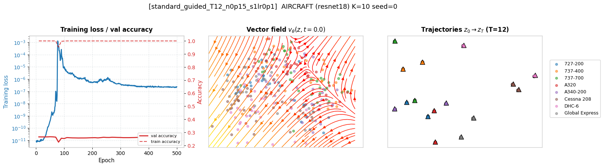

**DTD / DINOv2 ViT-S/14**
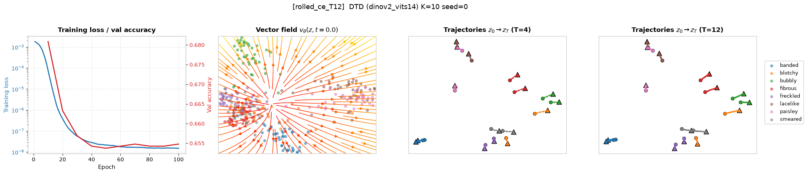
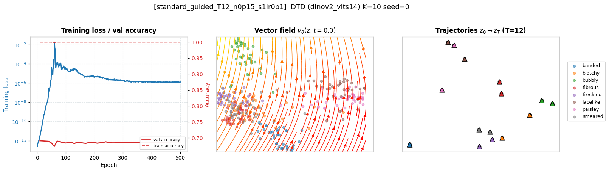

### Feature-space visualization

**FGVC-Aircraft / ResNet-18**
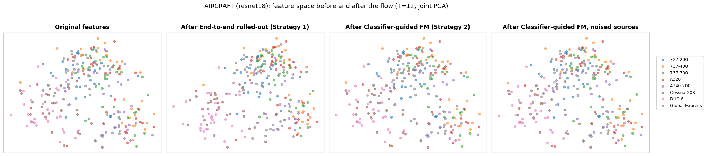

**DTD / DINOv2 ViT-S/14**
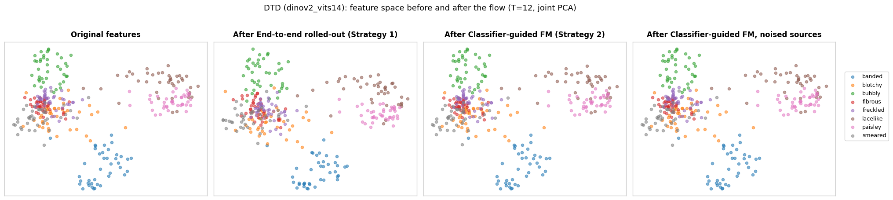

Each figure shows, left to right: the **original test features** $z$, the features
transported by the **end-to-end rolled-out** flow, and the features transported by the
**classifier-guided** flow. All panels use the **test** split at $K = 10$, $T = 12$,
seed 0, restricted to the same readable subset of 8 classes, with the same class colours
throughout. The projection is a single PCA fitted **jointly** over all three feature sets,
so a point is directly comparable across panels and the panels cannot be rescaled relative
to one another. The jointly fine-tuned flow is deliberately excluded here, since it belongs
to the extension rather than to the frozen-classifier comparison.

### Secondary comparison at $K = \text{full}$

The brief fixes one training-set size for the main experiments, but the amount of training
data turns out to be the variable that decides whether the FM layer can help at all, so the
same comparison is repeated with the full training split.

<!-- Paste the output of `markdown_main_table(full_table)` from cell 7.1 here. -->

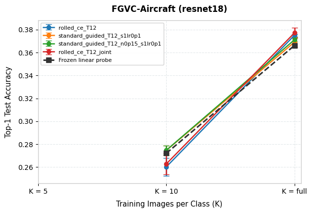
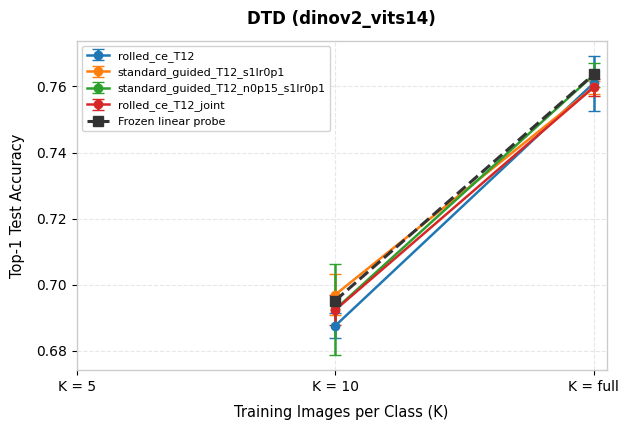

### Ablations requested by the brief

**Strategy 1 — regularising the transformation.** Penalising the displacement
$\lVert \hat{z} - z \rVert^2$ or the magnitude of the predicted velocities, both normalised
by the mean squared feature norm so the weights mean the same thing on both encoders.
Seed 0; the last column is the improvement over the unregularised objective.

| Configuration | Aircraft delta | vs plain | DTD delta | vs plain |
| --- | --- | --- | --- | --- |
| `rolled_ce_T12` (no penalty) | -0.0105 | - | -0.0074 | - |
| `dl0p1` (displacement, $\lambda = 0.1$) | +0.0051 | +0.0156 | -0.0037 | +0.0037 |
| `dl1` (displacement, $\lambda = 1$) | +0.0036 | +0.0141 | -0.0043 | +0.0031 |
| `vl0p1` (velocity, $\lambda = 0.1$) | +0.0039 | +0.0144 | -0.0027 | +0.0047 |
| `vl1` (velocity, $\lambda = 1$) | +0.0066 | +0.0171 | -0.0043 | +0.0031 |

**All eight comparisons improve on the unregularised objective**, and on Aircraft the sign
flips from clearly negative to positive. This is the clearest single effect in the study
and it is exactly the remedy the brief suggests: most of the damage the rolled-out objective
does comes from moving the representation further than the saturated loss can justify.

**Strategy 2 — the target-construction knobs.** Feature-space step size, number of
target-improvement steps, whether the target update is normalised (each step constrained to
a fixed fraction of the feature norm), and how often the targets are recomputed. Seed 0.

| Configuration | Aircraft delta | DTD delta |
| --- | --- | --- |
| `s1lr0p01` (step size 0.01) | -0.0009 | +0.0005 |
| `s1lr0p1` (step size 0.1, reference) | -0.0030 | +0.0005 |
| `s1lr1` (step size 1.0) | +0.0027 | +0.0016 |
| `s3lr0p1` (3 target steps) | +0.0003 | -0.0064 |
| `s10lr0p1` (10 target steps) | -0.0024 | -0.0027 |
| `s1lr0p1_norm` (constrained step) | +0.0033 | -0.0005 |
| `s1lr0p1_r10` (refresh every 10 epochs) | +0.0015 | +0.0000 |
| `s1lr0p1_r50` (refresh every 50 epochs) | +0.0000 | +0.0000 |

Three readings. **Step size:** larger is better, which is what the saturation analysis
predicts — the raw gradient is so small that only a large multiplier produces a target
distinguishable from $\hat z$. **Number of steps:** more steps hurt, because repeated
descent on an already-saturated loss walks the target off the feature manifold rather than
toward a better-classified point. **Refresh rate:** recomputing every 50 epochs gives
exactly $+0.0000$ on both cells, i.e. the flow reverts to the identity — the targets go
stale, the regression converges to them, and nothing further happens.

---

## Optional extension: jointly fine-tuning the classifier

After the frozen-classifier experiments we unfroze the pretrained linear classifier and
optimised it jointly with the FM transformation (`rolled_ce_T12_joint`). The classifier is
trained on a private copy, so the frozen Stage 1 probe used as the baseline is never
modified.

<!-- The joint rows are also part of the main table above. -->

| Dataset | Encoder | Method | Top-1 accuracy | Delta vs probe |
| --- | --- | --- | --- | --- |
| FGVC-Aircraft | ResNet-18 | Frozen classifier (`rolled_ce_T12`) | 0.2601 +/- 0.0079 | -0.0119 +/- 0.0073 |
| FGVC-Aircraft | ResNet-18 | Joint fine-tuning | 0.2627 +/- 0.0093 | -0.0093 +/- 0.0087 |
| DTD | DINOv2 ViT-S/14 | Frozen classifier (`rolled_ce_T12`) | 0.6876 +/- 0.0038 | -0.0076 +/- 0.0077 |
| DTD | DINOv2 ViT-S/14 | Joint fine-tuning | 0.6924 +/- 0.0046 | -0.0029 +/- 0.0035 |

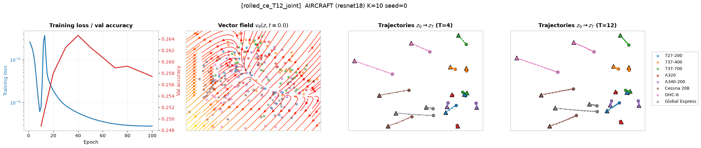
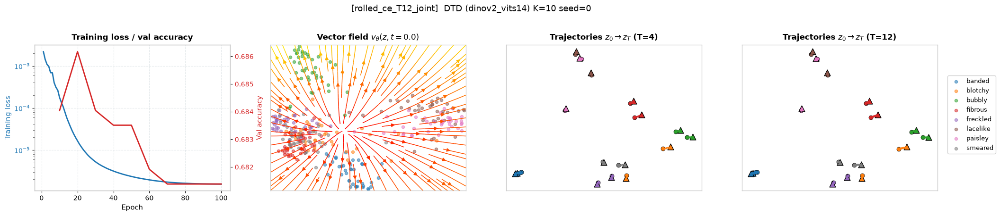

Unfreezing the classifier is marginally *better* than keeping it frozen under the same
rolled-out objective ($+0.0026$ on Aircraft, $+0.0047$ on DTD), but both stay below the
Stage 1 probe and neither difference clears its own spread. The honest reading is that the
extension changes nothing at this training-set size, which is consistent with the diagnosis
above: the bottleneck is the absence of a useful classification gradient, and adding
trainable classifier parameters does not create one.

This also rules out the more intuitive "it overfits harder" explanation. At $K = 10$ the
*frozen* probe is already at 100% training accuracy, so there is no additional memorisation
left for the joint variant to exploit — which is why unfreezing neither helps nor hurts much.
The training-accuracy curve now logged in the dynamics figures is the direct check.

---

## Conclusions

1. **At $K = 10$, neither strategy changes the frozen linear probe by a statistically
   supported amount.** No delta in the main table clears twice its paired standard
   deviation over three seeds. The signs are nonetheless consistent: the rolled-out
   objective and the joint extension are negative on 5 of 6 runs each, the classifier-guided
   objective is non-negative on 5 of 6.
2. **We can say precisely why.** Both strategies read the same signal — the gradient of the
   classification loss at the training features — and at $K = 10$ the frozen probe is at
   100% training accuracy with a cross-entropy of $1.8\times10^{-3}$ (DINOv2) to
   $2.2\times10^{-2}$ (ResNet-18). One classifier-guided target step consequently moves a
   feature by $3.6\times10^{-6}$ of its norm on DINOv2. The flow is not failing to
   optimise; it is being asked to learn from a gradient that is numerically zero, and a
   field initialised at the identity correctly stays there.
3. **The two strategies fail differently.** Strategy 2 collapses to the identity, which is
   harmless — its deltas cluster at zero. Strategy 1 keeps a usable gradient only in the
   directions that sharpen already-correct training points, so it moves the representation
   and loses accuracy. The brief's own suggested remedy fixes this: penalising displacement
   or velocity beats the unregularised objective in all eight comparisons.
4. **The failure is a property of the data regime, and it can be escaped.** Perturbing the
   sources hard enough to manufacture genuine classifier errors ($\sigma = 1.0$) produces
   the only clear gain in the study, $+0.0176$ on DTD/DINOv2, with diagnostics showing real
   transport: features move 30% of their norm and 86 test images are fixed against 53
   broken. This supports the interpretation in (2) rather than contradicting it — the flow
   helps exactly when the classifier is given something to be wrong about.
5. **Joint fine-tuning does not rescue the frozen-classifier result** ($-0.0093$ Aircraft,
   $-0.0029$ DTD). Adding trainable classifier parameters in a regime whose bottleneck is
   the absence of training signal increases capacity where it cannot help.

**Caveat.** Points 3 and 4 rest on single-seed runs and are reported as leads. The
three-seed confirmation of the surviving configurations is the remaining work.

