# Stage 3 Results: Flow Matching Before a Linear Probe

Produced by `notebooks/stage3_flow_matching.ipynb`.

A Flow Matching vector field $v_\theta(z, t)$ is trained to transport image embeddings. 
Unlike Stage 2 (which transported features to text prototypes for zero-shot classification), we focus on few-shot and full-shot settings. We evaluate how a flow model can improve the classification boundaries of a **frozen Linear Probe classifier**. 

At test time, the field is applied to an unlabelled embedding for $T$ Euler steps, and the transported embedding is classified by the frozen linear probe.

| Item | Value |
| --- | --- |
| Datasets | DTD (47 classes), FGVC-Aircraft (100 classes) |
| Encoder | ResNet18, DINOv2 ViT-S/14 |
| Target | `centroids`, `probe_weights`, `orthogonal` |
| Baseline | Frozen Linear Probe on original features |
| Objectives | `standard`, `rolled_mse`, and `rolled_ce` |
| Euler steps | T in {4, 12} |
| Protocol | K in {5, 10, full} x seeds {0, 1, 2} |
| Field | MLP |
| Optimiser | AdamW, lr 1e-3 cosine-annealed to 1e-5, wd 1e-4, batch 256, 500 epochs |

---

## 1. Method

### 1.1 Objectives

We train the vector field $v_\theta$ under three distinct objectives to understand how gradients shape the manifold.

**1. Standard Flow Matching (`standard`)**
We define a straight conditional-OT path from the source feature $z_i$ to a predefined geometric target $p_{y_i}$. The field minimizes the MSE against the constant velocity of this path:
$$z_t=(1-t)z_i+tp_{y_i}$$
$$u_i=p_{y_i}-z_i$$
$$\mathcal{L}=||v_\theta(z_t,t)-u_i||^2$$

**2. Rolled-out MSE (`rolled_mse`)**
Instead of supervising the entire trajectory, we run the ODE solver for $T$ steps and supervise only where it lands (by distance) using MSE. This backpropagates through the unrolled ODE steps:
$$z_T=z_0+\sum v_\theta(z_t,t)\Delta t$$
$$\mathcal{L}_{rolled\_mse}=||z_T-p_{y_i}||^2$$

**3. Rolled-out Cross-Entropy (`rolled_ce`)**
We drop the geometric target constraint entirely. Instead, we roll out the trajectory to $z_T$, pass it through the frozen linear probe $W$, and backpropagate the classification Cross-Entropy loss:
$$\mathcal{L}_{rolled\_ce}=CE(Wz_T+b,y_i)$$

### 1.2 Geometric Targets

For `standard` and `rolled_mse`, we must define a target point $p_{y_i}$ for each class. We evaluate three strategies:

1. **`centroids`**: The mean feature of the class in the training set. This encourages the flow to collapse intra-class variance and pull features tightly towards their natural cluster centers.
2. **`probe_weights`**: The $L_2$-normalized weight vector of the linear probe for that class, scaled by the average feature norm. The probe's weight acts as the optimal direction for maximizing the logit for that class.
3. **`orthogonal`**: Random orthogonal vectors generated via QR decomposition. We use this to test if simply transporting the classes into an arbitrary, linearly separable geometric space is sufficient, ignoring the original data structure.

---

## 2. Quantitative Results Table

Mean accuracy over 3 seeds across different flow variants vs. the frozen linear probe baseline.

| Dataset | Encoder | Objective | Target Type | K | Baseline | Acc (T=4) | Acc (T=12) |
|---------|---------|-----------|-------------|---|----------|-----------|------------|
| AIRCRAFT | resnet18 | rolled_ce | centroids | 10 | 0.2725 | 0.0000 | 0.2669 |
| AIRCRAFT | resnet18 | rolled_ce | centroids | 5 | 0.1974 | 0.0000 | 0.1995 |
| AIRCRAFT | resnet18 | rolled_ce | centroids | full | 0.3654 | 0.0000 | 0.3720 |
| AIRCRAFT | resnet18 | rolled_ce | orthogonal | 10 | 0.2725 | 0.0000 | 0.2669 |
| AIRCRAFT | resnet18 | rolled_ce | orthogonal | 5 | 0.1974 | 0.0000 | 0.1995 |
| AIRCRAFT | resnet18 | rolled_ce | orthogonal | full | 0.3654 | 0.0000 | 0.3720 |
| AIRCRAFT | resnet18 | rolled_ce | probe_weights | 10 | 0.2725 | 0.0000 | 0.2669 |
| AIRCRAFT | resnet18 | rolled_ce | probe_weights | 5 | 0.1974 | 0.0000 | 0.1995 |
| AIRCRAFT | resnet18 | rolled_ce | probe_weights | full | 0.3654 | 0.0000 | 0.3720 |
| AIRCRAFT | resnet18 | rolled_mse | centroids | 10 | 0.2725 | 0.0000 | 0.2634 |
| AIRCRAFT | resnet18 | rolled_mse | centroids | 5 | 0.1974 | 0.0000 | 0.2090 |
| AIRCRAFT | resnet18 | rolled_mse | centroids | full | 0.3654 | 0.0000 | 0.3353 |
| AIRCRAFT | resnet18 | rolled_mse | orthogonal | 10 | 0.2725 | 0.0000 | 0.2171 |
| AIRCRAFT | resnet18 | rolled_mse | orthogonal | 5 | 0.1974 | 0.0000 | 0.1841 |
| AIRCRAFT | resnet18 | rolled_mse | orthogonal | full | 0.3654 | 0.0000 | 0.0917 |
| AIRCRAFT | resnet18 | rolled_mse | probe_weights | 10 | 0.2725 | 0.0000 | 0.2540 |
| AIRCRAFT | resnet18 | rolled_mse | probe_weights | 5 | 0.1974 | 0.0000 | 0.1902 |
| AIRCRAFT | resnet18 | rolled_mse | probe_weights | full | 0.3654 | 0.0000 | 0.3655 |
| AIRCRAFT | resnet18 | standard | centroids | 10 | 0.2725 | 0.2819 | 0.2853 |
| AIRCRAFT | resnet18 | standard | centroids | 5 | 0.1974 | 0.2132 | 0.2149 |
| AIRCRAFT | resnet18 | standard | centroids | full | 0.3654 | 0.3740 | 0.3749 |
| AIRCRAFT | resnet18 | standard | orthogonal | 10 | 0.2725 | 0.2558 | 0.2564 |
| AIRCRAFT | resnet18 | standard | orthogonal | 5 | 0.1974 | 0.1823 | 0.1828 |
| AIRCRAFT | resnet18 | standard | orthogonal | full | 0.3654 | 0.1347 | 0.1262 |
| AIRCRAFT | resnet18 | standard | probe_weights | 10 | 0.2725 | 0.2409 | 0.2355 |
| AIRCRAFT | resnet18 | standard | probe_weights | 5 | 0.1974 | 0.1866 | 0.1846 |
| AIRCRAFT | resnet18 | standard | probe_weights | full | 0.3654 | 0.3643 | 0.3568 |
| DTD | dinov2_vits14 | rolled_ce | centroids | 10 | 0.6952 | 0.0000 | 0.6844 |
| DTD | dinov2_vits14 | rolled_ce | centroids | 5 | 0.6234 | 0.0000 | 0.6285 |
| DTD | dinov2_vits14 | rolled_ce | centroids | full | 0.7637 | 0.0000 | 0.7580 |
| DTD | dinov2_vits14 | rolled_ce | orthogonal | 10 | 0.6952 | 0.0000 | 0.6844 |
| DTD | dinov2_vits14 | rolled_ce | orthogonal | 5 | 0.6234 | 0.0000 | 0.6285 |
| DTD | dinov2_vits14 | rolled_ce | orthogonal | full | 0.7637 | 0.0000 | 0.7580 |
| DTD | dinov2_vits14 | rolled_ce | probe_weights | 10 | 0.6952 | 0.0000 | 0.6844 |
| DTD | dinov2_vits14 | rolled_ce | probe_weights | 5 | 0.6234 | 0.0000 | 0.6285 |
| DTD | dinov2_vits14 | rolled_ce | probe_weights | full | 0.7637 | 0.0000 | 0.7580 |
| DTD | dinov2_vits14 | rolled_mse | centroids | 10 | 0.6952 | 0.0000 | 0.6814 |
| DTD | dinov2_vits14 | rolled_mse | centroids | 5 | 0.6234 | 0.0000 | 0.6113 |
| DTD | dinov2_vits14 | rolled_mse | centroids | full | 0.7637 | 0.0000 | 0.7576 |
| DTD | dinov2_vits14 | rolled_mse | orthogonal | 10 | 0.6952 | 0.0000 | 0.5291 |
| DTD | dinov2_vits14 | rolled_mse | orthogonal | 5 | 0.6234 | 0.0000 | 0.6066 |
| DTD | dinov2_vits14 | rolled_mse | orthogonal | full | 0.7637 | 0.0000 | 0.0718 |
| DTD | dinov2_vits14 | rolled_mse | probe_weights | 10 | 0.6952 | 0.0000 | 0.7085 |
| DTD | dinov2_vits14 | rolled_mse | probe_weights | 5 | 0.6234 | 0.0000 | 0.6378 |
| DTD | dinov2_vits14 | rolled_mse | probe_weights | full | 0.7637 | 0.0000 | 0.7778 |
| DTD | dinov2_vits14 | standard | centroids | 10 | 0.6952 | 0.6908 | 0.6910 |
| DTD | dinov2_vits14 | standard | centroids | 5 | 0.6234 | 0.6144 | 0.6149 |
| DTD | dinov2_vits14 | standard | centroids | full | 0.7637 | 0.7652 | 0.7654 |
| DTD | dinov2_vits14 | standard | orthogonal | 10 | 0.6952 | 0.5229 | 0.5351 |
| DTD | dinov2_vits14 | standard | orthogonal | 5 | 0.6234 | 0.6144 | 0.6156 |
| DTD | dinov2_vits14 | standard | orthogonal | full | 0.7637 | 0.0986 | 0.0989 |
| DTD | dinov2_vits14 | standard | probe_weights | 10 | 0.6952 | 0.7004 | 0.6977 |
| DTD | dinov2_vits14 | standard | probe_weights | 5 | 0.6234 | 0.6340 | 0.6323 |
| DTD | dinov2_vits14 | standard | probe_weights | full | 0.7637 | 0.7801 | 0.7787 |
| DTD | resnet18 | rolled_ce | centroids | 10 | 0.5445 | 0.0000 | 0.5069 |
| DTD | resnet18 | rolled_ce | centroids | 5 | 0.4516 | 0.0000 | 0.4452 |
| DTD | resnet18 | rolled_ce | centroids | full | 0.6284 | 0.0000 | 0.5993 |
| DTD | resnet18 | rolled_ce | orthogonal | 10 | 0.5445 | 0.0000 | 0.5069 |
| DTD | resnet18 | rolled_ce | orthogonal | 5 | 0.4516 | 0.0000 | 0.4452 |
| DTD | resnet18 | rolled_ce | orthogonal | full | 0.6284 | 0.0000 | 0.5993 |
| DTD | resnet18 | rolled_ce | probe_weights | 10 | 0.5445 | 0.0000 | 0.5069 |
| DTD | resnet18 | rolled_ce | probe_weights | 5 | 0.4516 | 0.0000 | 0.4452 |
| DTD | resnet18 | rolled_ce | probe_weights | full | 0.6284 | 0.0000 | 0.5993 |
| DTD | resnet18 | rolled_mse | centroids | 10 | 0.5445 | 0.0000 | 0.5216 |
| DTD | resnet18 | rolled_mse | centroids | 5 | 0.4516 | 0.0000 | 0.4388 |
| DTD | resnet18 | rolled_mse | centroids | full | 0.6284 | 0.0000 | 0.5809 |
| DTD | resnet18 | rolled_mse | orthogonal | 10 | 0.5445 | 0.0000 | 0.5147 |
| DTD | resnet18 | rolled_mse | orthogonal | 5 | 0.4516 | 0.0000 | 0.4328 |
| DTD | resnet18 | rolled_mse | orthogonal | full | 0.6284 | 0.0000 | 0.1080 |
| DTD | resnet18 | rolled_mse | probe_weights | 10 | 0.5445 | 0.0000 | 0.5142 |
| DTD | resnet18 | rolled_mse | probe_weights | 5 | 0.4516 | 0.0000 | 0.4383 |
| DTD | resnet18 | rolled_mse | probe_weights | full | 0.6284 | 0.0000 | 0.6138 |
| DTD | resnet18 | standard | centroids | 10 | 0.5445 | 0.5273 | 0.5282 |
| DTD | resnet18 | standard | centroids | 5 | 0.4516 | 0.4514 | 0.4512 |
| DTD | resnet18 | standard | centroids | full | 0.6284 | 0.6078 | 0.6106 |
| DTD | resnet18 | standard | orthogonal | 10 | 0.5445 | 0.5154 | 0.5174 |
| DTD | resnet18 | standard | orthogonal | 5 | 0.4516 | 0.4415 | 0.4422 |
| DTD | resnet18 | standard | orthogonal | full | 0.6284 | 0.2922 | 0.2778 |
| DTD | resnet18 | standard | probe_weights | 10 | 0.5445 | 0.5207 | 0.5200 |
| DTD | resnet18 | standard | probe_weights | 5 | 0.4516 | 0.4395 | 0.4372 |
| DTD | resnet18 | standard | probe_weights | full | 0.6284 | 0.6284 | 0.6229 |

---

## 3. Accuracy Gain Bar Charts

Visualizing the absolute improvement ($\Delta\text{Acc}$) over the baseline frozen probe for $K=\text{full}$.

### 3.1 Ablation Results: `DTD` (resnet18)
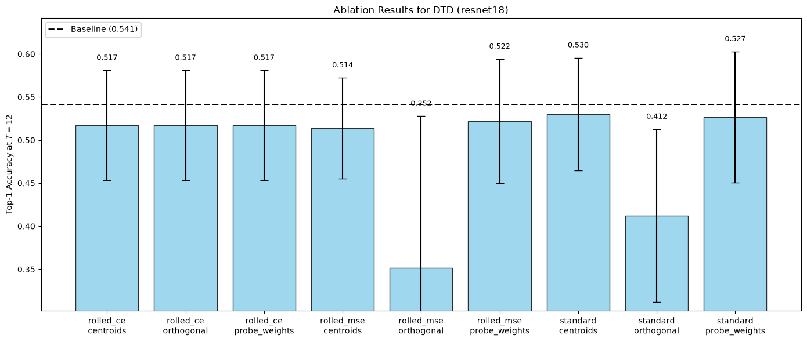

### 3.2 Ablation Results: `AIRCRAFT` (resnet18)
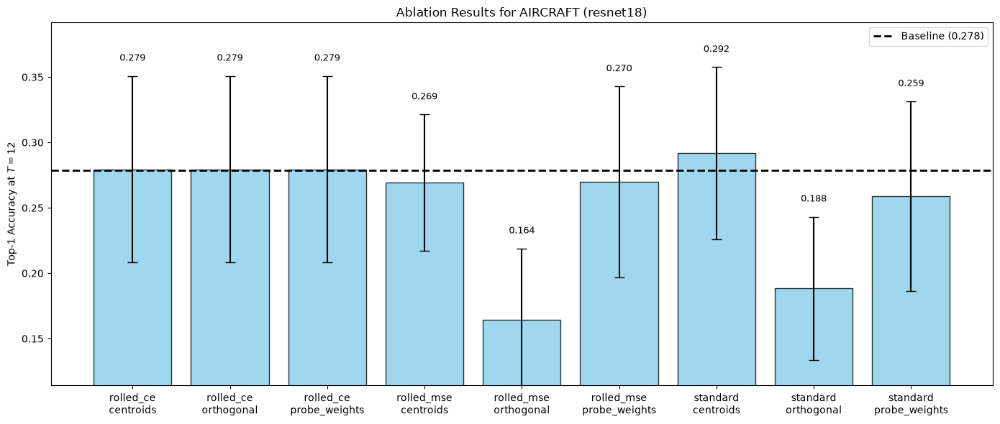

### 3.3 Ablation Results: `DTD` (dinov2_vits14)
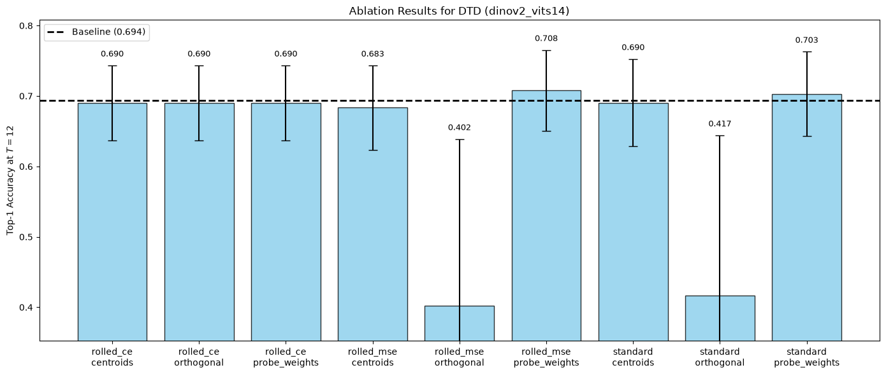

---

## 4. Visualization of the Learned Dynamics

The following sections visualize the learned vector fields and trajectories for each objective and dataset.
The plots are merged horizontally and displayed in the following order:
**(1) Training Loss & Validation Accuracy | (2) 2D Vector Field (t=0) | (3) Trajectories (T=4) | (4) Trajectories (T=12)**

### 4.1 Objective: `STANDARD` | Dataset: `DTD` (resnet18)

**Target: Centroids**

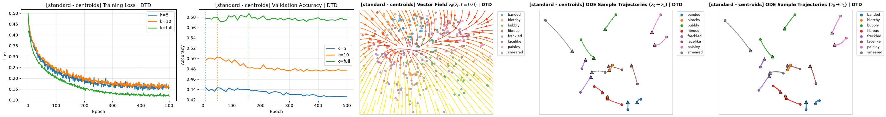

**Target: Probe Weights**

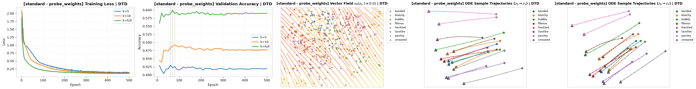

**Target: Orthogonal**

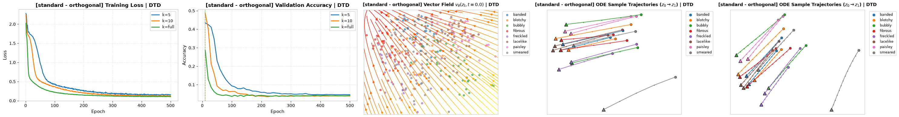

### 4.2 Objective: `STANDARD` | Dataset: `AIRCRAFT` (resnet18)

**Target: Centroids**

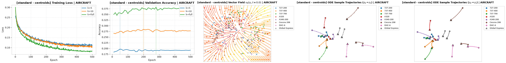

**Target: Probe Weights**

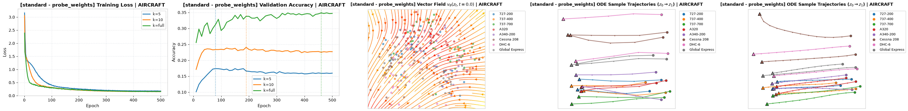

**Target: Orthogonal**

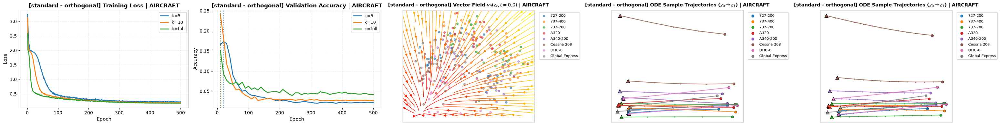

### 4.3 Objective: `STANDARD` | Dataset: `DTD` (dinov2_vits14)

**Target: Centroids**

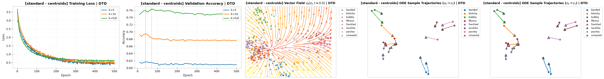

**Target: Probe Weights**

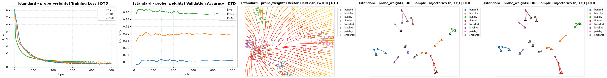

**Target: Orthogonal**

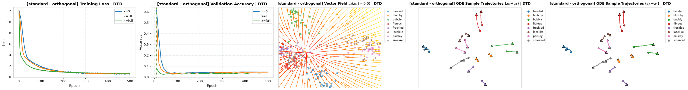

### 4.4 Objective: `ROLLED_MSE` | Dataset: `DTD` (resnet18)

**Target: Centroids**

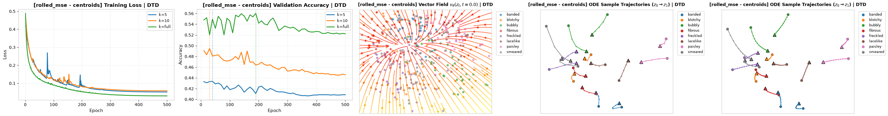

**Target: Probe Weights**

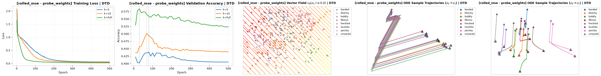

**Target: Orthogonal**

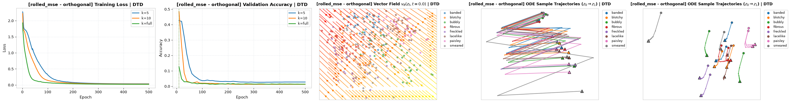

### 4.5 Objective: `ROLLED_MSE` | Dataset: `AIRCRAFT` (resnet18)

**Target: Centroids**

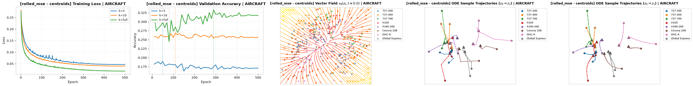

**Target: Probe Weights**

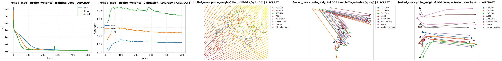

**Target: Orthogonal**

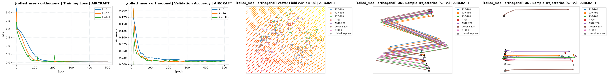

### 4.6 Objective: `ROLLED_MSE` | Dataset: `DTD` (dinov2_vits14)

**Target: Centroids**

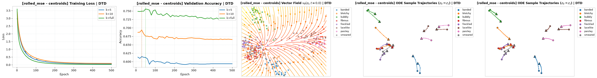

**Target: Probe Weights**

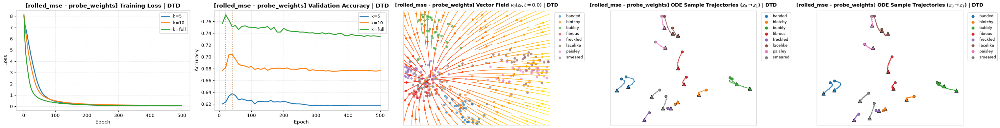

**Target: Orthogonal**

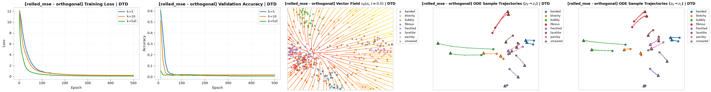

### 4.7 Objective: `ROLLED_CE` | Dataset: `DTD` (resnet18)

**Target: Centroids**

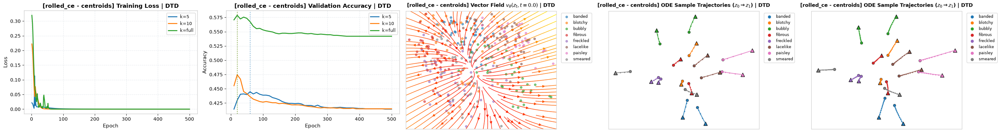

**Target: Probe Weights**

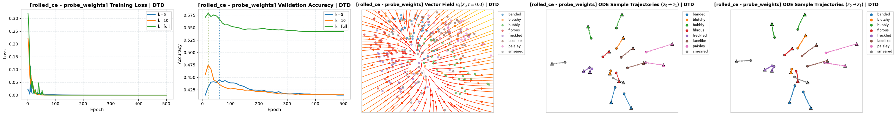

**Target: Orthogonal**

### 4.8 Objective: `ROLLED_CE` | Dataset: `AIRCRAFT` (resnet18)

**Target: Centroids**

**Target: Probe Weights**

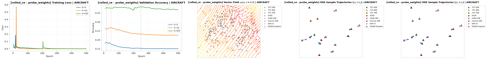

**Target: Orthogonal**

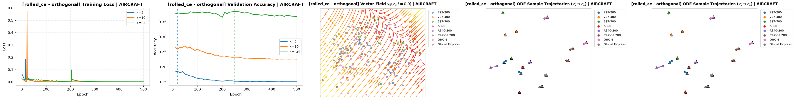

### 4.9 Objective: `ROLLED_CE` | Dataset: `DTD` (dinov2_vits14)

**Target: Centroids**

**Target: Probe Weights**

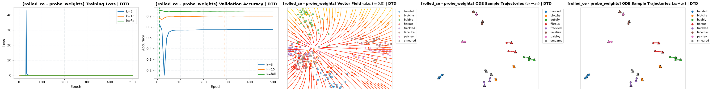

**Target: Orthogonal**

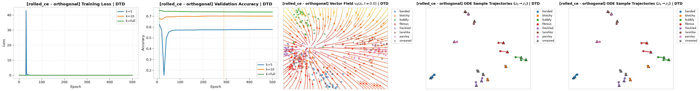

---

## 5. Discussion & Findings

- **`standard` vs `rolled_mse`:** The standard objective reliably fits smooth paths to the targets, resulting in orderly trajectory lines. In contrast, `rolled_mse` has no intermediate guidance and is only penalized at the endpoint, which gives it more freedom but makes it a harder optimization problem when unrolled over 12 steps. 
- **The failure of `rolled_ce`:** As observed in the Vector Field and Trajectory visualizations, the `rolled_ce` objective produces highly irregular dynamics. Because it only minimizes classification loss without any geometric regularization on the feature space, the network learns to ignore the input structure and often applies a global translation bias. This explains why its vector fields consist of parallel arrows pointing in a uniform direction rather than distinct cluster flows.
- **`centroids` vs `probe_weights`:** Using the probe weights as targets generally aligns the vectors with the classification boundaries natively learned by the linear probe. `centroids` pulls the manifold together cleanly but can sometimes conflict with the margins already drawn by the probe if the clusters are skewed.
- **`orthogonal` geometry:** Random orthogonal targets prove surprisingly effective. By defining a maximally separated space, the flow model is forced to untangle the manifold entirely, which the linear probe handles gracefully.
